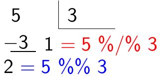

# Sobre o curso

## Preparando o ambiente {.smaller}

```{r, message=FALSE}
#| echo: false
knitr::opts_chunk$set(echo = TRUE, results = "markup", message = F,
                    comment = "##", fig.align = "center")
library(dados)
library(readxl)
library(tidyverse)
library(tidyverse)
```

* Use, pelo menos, a versão `4.1` da linguagem `R`: [cran.r-project.org](https://cran.r-project.org/)
* **IDE** recomendadas: [Rstudio](https://www.rstudio.com/products/rstudio/download/preview/) e [VSCode](https://code.visualstudio.com/Download)
    * Caso você queria usar o [VSCode](https://code.visualstudio.com/Download), instale a extensão da linguagem `R`: [r-pack](https://marketplace.visualstudio.com/items?itemName=Ikuyadeu.r-pack&ssr=false#overview)
* Neste curso usaremos o _framework_ `tidyverse`
    * Instale usando o seguinte comando `install.packages('tidyverse')`
* Outras linguagens populares para análise de dados:
    * [`python`](https://www.python.org/): linguagem interpretada de próposito geral, contemporânea do `R`, simples e fácil de aprender. Podemos realizar análise de dados  usando os pacotes `pandas` e `numpy`, mas, ao contrário do `R`, [`python`](https://www.python.org/) não foi projetada e criada para análise de dados
    * [`julia`](https://julialang.org/): linguagem interpretada para análise de dados projeto pelo MIT, lançada em 2012, promete simplicidade e velocidade. Comunidade de usuários pequena, mas crescente.

# A linguagem `R`<br><br>Uma introdução breve

## O começo de tudo {.smaller}

### `S`, o precursor da linguagem `R`:

* `R` é uma linguagem derivada do `S`
* `S` foi desenvolvido em `fortran` for **John Chambers** em 1976 no **_Bell Labs_**
* `S` foi desenvolvido para a análise de dados
* **Filosofia do `S`:** permitir que usuários possam analisar dados usando estatística com pouco conhecimento de programação

### Origem da linguagem `R`

* Em 1991, **Ross Ihaka** e **Robert Gentleman** criaram o `R` na Nova Zelândia
*  Em 1996, **Ross** e **Robert** liberam o `R` sob a licença _GNU General License_
* Em 1997, **The Core Group** é criado para melhorar e controlar o código fonte do `R`

## Motivos para usar `R`

* Constante melhoramento e atualização.
* Portabilidade (roda em praticamente todos os sistemas operacionais).
* Grande comunidade de desenvolvedores que adicionam novas capacidades ao `R` através de pacotes.
* Gráficos de maneira relativamente simples.
* Interatividade.
* Um grande comunidade de usuários (especialmente útil para resolução de problemas).

## Onde estudar fora de aula?

### Livros 

* **Nível _cheguei agora aqui_:** [zen do R](https://curso-r.github.io/zen-do-r/index.html)
* **Nível Iniciante:** [R Tutorial na W3Schools](https://www.w3schools.com/r/default.asp)
* **Nível Iniciante:** [Hands-On Programming with `R`](https://rstudio-education.github.io/hopr/)
* **Nível Intermediário:** [`R` for Data Science](https://r4ds.had.co.nz)
* **Nível Avançado:** [Advanced `R`](https://adv-r.hadley.nz)

### Em pt-br

* Curso-R: [material.curso-r.com](http://material.curso-r.com/)

## O que você pode fazer quando estiver em apuros? {.smaller}

* check a documentação do `R`: 
```{r}
#| label: help
#| eval: false
help(mean)
?mean
```
* Peça ajuda a um programador mais experiente
* Consulte o [pt.stackoverflow.com](https://pt.stackoverflow.com/)
* Use ferramentas de busca como o [google](https://www.google.com.br/) e [duckduckgo.com](https://duckduckgo.com/)
```{r}
#| label: error
#| error: true
log("G")
```
* Na ferramenta de busca, pesquise por `Error in log("G"): non-numeric argument to mathematical function`


## Operações básicas {.smaller}

**Soma**

```{r}
1 + 1
```

**Substração**

```{r}
2 - 1
```

**Divisão**

```{r}
3 / 2
```

## Operações básicas {.smaller}

**Potenciação**

```{r}
2^3
```


**Resto da divisão**

```{r}
5 %% 3
```

**Parte inteira da divisão**

```{r}
5 %/% 3
```

---

```{r}
#| echo: false
#| out.width: 60%

```

## Estrutura de dados em `R` {.smaller}

* **Estrutura de dados:** atomic `vector` (a estrutura de dados mais básico no `R`), `matrix`, `array`, `list` e `data.frame` (`tibble` no `tidyverse`)
* **Tipo de dados:** caracter (`character`), número real (`double`), número inteiro (`integer`), número complexo (`complex`) e lógico (`logical`)
* **Estrutura de dados homogênea:** `vector`, `matrix` e `array`
* **Estrutura de dados heterôgenea:** `list` e `data.frame` (`tibble` no `tidyverse`)

# Tipo de dados em `R` 

## Valores numéricos {.smaller}


**Número inteiro**

```{r}
class(1L)
```

**Número real**

```{r}
class(1.2)
```

**Número complexo**

```{r}
class(1 + 1i)
```

## Valores lógicos

**Valor lógico**

```{r}
class(TRUE)
```

## Valoes de texto (caracter ou string)

```{r}
class("Gilberto")
```

# Estrutura de dados homogênea

## Vetor {.smaller}

* Agrupamento de valores de mesmo tipo em um único objeto
* Criação de vetores: `c(...)` e `vector('<tipo de dados>', <comprimento do vetor>)`, `vector()` é bastante usado em _laços de repetição_, que veremos na semana 4, o operador `:` e `seq(from = a, to = b, by = c)` 

**Vetor de caracteres**

```{r}
a  <- c("Gilberto", "Sassi")
a
```
```{r}
b <- vector("character", 3)
b
```

## Vetor de números reais

```{r}
a  <- c(0.2, 1.35)
a
```

```{r}
b <- vector("double", 3)
b
```

```{r}
d <- seq(from = 1, to = 3.5, by = 0.5)
d
```

## Vetor de números inteiros

```{r}
a  <- c(1L, 2L)
a
```

```{r}
b <- vector("integer", 3)
b
```

## Vetor de valores lógicos

```{r}
a  <- c(TRUE, FALSE)
a
```

```{r}
b <- vector("logical", 3)
b
```

## Matriz {.smaller}

* Agrupamento de valores de mesmo tipo em um único objeto de dimensão 2
* Criação de vetores: `matrix(..., nrow = <integer>, ncol = <integer>)` ou `diag(<vector>)`

**Matriz de caracteres**

```{r}
a <- matrix(c("a", "b", "c", "d"), nrow = 2)
a
```

**Matriz de números reais**

```{r}
a <- matrix(seq(from = 0, to = 1.5, by = 0.5), nrow = 2)
a
```

## Matriz

**Matriz de inteiros**

```{r}
a <- matrix(1L:4L, nrow = 2)
a
```

**Matriz de valores lógicos**

```{r}
(a <- matrix(c(TRUE, F, F, T), nrow = 2))
```


## Operações com vetores {.smaller}

* Operações básicas (operação, substração, multiplicação e divisão ) realizada em cada elemento do vetor
* _Slicing_: extrai parte de um vetor (não precisa ser vetor numérico)

**_slicing_**

```{r}
a <- c("a", "b", "c", "d", "e", "f", "g", "h", "i")
a[1:5] # selecionado todos os elementos entre o primeiro e o quinta
```

**adição**

```{r}
a <- 1:5
b <- 6:10
a + b
```

## Operações com vetores {.smaller}

**subtração**

```{r}
a <- 1:5
b <- 6:10
b - a
```

**multiplicação**

```{r}
b * a
```

**divisão**

```{r}
b / a
```

## Operações com matrizes {.smaller}

* Operações básicas (operação, substração, multiplicação e divisão) realizada em cada elemento das matrizes
* Multiplicação de matrizes (vide [multiplicação de matrizes](https://pt.wikipedia.org/wiki/Produto_de_matrizes)), inversão de matrizes (vide [inversão de matrizes](https://pt.wikipedia.org/wiki/Matriz_inversa)), matriz transposta (vide [matriz transposta](https://pt.wikipedia.org/wiki/Matriz_transposta)), determinante (vide [determinante de uma matriz](https://pt.wikipedia.org/wiki/Determinante)) e solução de sistema de equações lineares (vide [sistema de equações lineares](https://pt.wikipedia.org/wiki/Sistema_de_equações_lineares))

**soma**

```{r}
matriz_a <- matrix(c(1, 2, 3, 4), nrow = 2)
matriz_b <- matrix(5:8, ncol = 2)
matriz_c <- matriz_a + matriz_b
matriz_c
```

## Operações com matrizes {.smaller}

**subtração**

```{r}
matriz_a <- matrix(c(1, 2, 3, 4), nrow = 2)
matriz_b <- matrix(5:8, ncol = 2)
matriz_c <- matriz_a - matriz_b
matriz_c
```

**produto de Hadamard**

* Para detalhes vide [produto de Hadamard](https://en.wikipedia.org/wiki/Hadamard_product_(matrices))

```{r}
matriz_c <- matriz_a * matriz_b
matriz_c
```

## Operações com matrizes 

**multiplicação de matrizes**

* Para detalhes vide [multiplicação de matrizes](https://pt.wikipedia.org/wiki/Matriz_inversa)

```{r}
matriz_c <- matriz_a %*% matriz_b
matriz_c
```

## Operações com matrizes {.smaller}

**matriz inversa**

* Para detalhes vide [matriz inversa](https://pt.wikipedia.org/wiki/Matriz_inversa)

```{r}
matriz_a <- matrix(1:4, nrow = 2)
matriz_b <- solve(matriz_a)
matriz_b
matriz_a %*% matriz_b
```

## Operações com matrizes {.smaller}

**matriz transposta**

* Para detalhes vide [matriz transposta](https://pt.wikipedia.org/wiki/Matriz_transposta)

```{r}
matriz_a <- matrix(1:4, ncol = 2)
matriz_b <- t(matriz_a)
matriz_b
```

**determinante**

```{r}
matriz_a <- matrix(1:4, ncol = 2)
det(matriz_a)
```

## Operações com matrizes {.smaller}

**solução de sistema de equações lineares**

* Para detalhes vide [sistema de equações lineares](https://pt.wikipedia.org/wiki/Sistema_de_equações_lineares)

```{r}
b <- c(1, 2)
matriz_a <- matrix(1:4, nrow = 2)
solve(matriz_a, b)
```

**matriz inversa generalizada**

* $G$ é a matriz inversa generalizada de $A$ se $A \cdot G \cdot A = A$. Para detalhes vide [matriz inversa generalizada](https://en.wikipedia.org/wiki/Generalized_inverse)

```{r, message=FALSE}
library(MASS) # ginv é uma função do pacote MASS
ginv(matriz_a)
```

## Operações com matrizes {.smaller}

**outras operações com matrizes**

|Operador ou função|Descrição|
|:--------------:|:-----------:|
|`A %o% B`| [produto diádico $A\cdot B^T$](https://pt.wikipedia.org/wiki/Produto_diádico)|
|`crossprod(A, B)`|[$A\cdot B^T$](https://pt.wikipedia.org/wiki/Produto_diádico)|
|`crossprod(A)`|[$A\cdot A^T$](https://pt.wikipedia.org/wiki/Produto_diádico)|
|`diag(x)`|retorna uma matrix diagonal com diagonal igual a `x` (`class(x) == 'numeric'`)|
|`diag(A)`|retorna um vetor com a diagona de $A$ (`class(A) == 'matrix'`)|
|`diag(k)`|retorna uma matriz diagona de ordem $k$ (`class(k) == 'numeric'`)|

## Estrutura de Dados Heterogênea 

**lista**

* Agrupamento de valores de tipos diversos e estrutura de dados 
* Criação de listas: `list(...)` e `vector("list", <comprimento da lista>)`

```{r}
a <- list(pedido_id = 8001406,
          nome = "Fulano",
          sobrenome = "de Tal",
          cpf = "12345678900",
          itens = list(list(descricao = "Ferrari",
                            frete = 0,
                            valor = 500000),
                      list(descricao = "Dolly", frete = 1.5, valor = 3.90)))
```

## Estrutura de Dados Heterogênea 

**Tidy data**

* Agrupamento de dados em tabela em que cada coluna é uma variável e cada linha é uma observação
* Criação de `tibble`: `tibble(...)` e `tribble(....)`

**`tibble` (data frame)**

```{r}
library(tidyverse) # carregando o framework tidyverse
a <- tibble(variavel_1 = c(1, 2), variavel_2 = c("a", "b"))
glimpse(a)
```

## Estrutura de Dados Heterogênea {.smaller}

**operações básicas em um `tibble`**

Vamos ver o uso dessas funções depois de aprender a carregar os dados no `R`.

|Função|Descrição|
|:---------:|:------------:|
|`head()`|Mostra as primeiras linhas de um `tibble`|
|`tail()`|Mostra as últimas linhas de um `tibble`|
|`glimpse()`|Impressão de informações básicas dos dados|
|`add_case()` ou `add_row()`|Adiciona uma nova observação|

## Estrutura de Dados Heterogênea

**concatenação de listas**

```{r}
a  <- list("a", "b")
b <- list(1, 2)
d <- c(a, b)
d
```

## Estrutura de Dados Heterogênea 

**_Slicing_ a lista**

```{r}
d[1:2]
```

## Estrutura de Dados Heterogênea 

**acessando o valor de um elemento de uma lista**

```{r}
d[[2]] # acessando o segundo elemento da lista d
```


**acessando o valor de elmento em uma lista pela chave**

```{r}
d <- list(chave_1 = 1, chave_2 = "docente")
d$chave_2 # retorna o valor
```

## Estrutura de Dados Heterogênea 

**_slicing_ uma lista usando chaves**

```{r}
d <- list(chave_1 = 1, chave_2 = "docente", chave_3 = list("olá"))
d[c("chave_2", "chave_3")] # funciona como slicing
```

## Estrutura de Dados Heterogênea 

**Enumerando chaves em um lista**

```{r}
d <- list(c(1, 2, 3), chave_1 = 1, chave_2 = "docente", chave_3 = list("olá"))
names(d)
```

## Valores especiais em `R` {.smaller}

|Valores especiais|Descrição|Função para identificar|
|:-------------:|:---------------:|:--------------------:|
|`NA` (Not Available)|Valor faltante.|`is.na()`|
|`NaN` (Not a Number)|Resultado do cálculo indefinido.|`is.nan()`|
|`Inf` (Infinito)|Valor que excede o valor máximo que sua máquina aguenta.|`is.inf()`|
|`NULL` (Nulo)|Valor indefinido de expressões e funções (diferente de `NaN` e `NA`)|`is.null()`|

## Parênteses 1: guia de estilo no `R` {.smaller}

* Nome de um objeto precisa ter um _significado_ (precisa falar imediatamente o que este objeto é ou faz)
* Use a convenção do `RStudio`:
  * Use apenas letras minúsculas, números e _underscore_ (comece sempre com letras minúsculas)
  * Nomes de objetos precisam ser substantivos
  * Evite ao máximo os nomes que são usados por objetos que são _buit-in_ do `R`
  * Coloque espaço depois da vírgula
* Use a convenção do `RStudio`:
  * Não coloque espaço antes nem depois de parênteses. Exceções: 
    * Coloque um espaço `()` antes e depois de `if`, `for` ou `while`
    * Coloque um espaço depois de `()` para funções.
  * Coloque espaço entre operadores básicos: `+`, `-`, `*`, `==` e outros. Exceção: `^`.

Para mais detalhes, consulte: [guia de estilo do `tidyverse`](https://style.tidyverse.org).

----

Existem outros estilos (padrões) de codificação para a linguagem `R`, por exemplo [guia de estilo do `google`](https://google.github.io/styleguide/Rguide.html). Mas o estilo mais usado e famoso é o _estilo de codificação do RStudio_. 

**Esolha um estilo e seja consistente! ~~Use apenas um estilo no se código~~**

## Parênteses 2: estrutura de diretórios  {.smaller}

* `data`: diretório para armazenar seus conjuntos de dados
    * `raw`: dados brutos
    * `processed`: dados processados
* `scripts`: código fonte do seu projeto
* `figures`: figuras criadas no seu projeto
* `output`: outros arquivos que não são figuras
* `previous`: arquivos da versão anterior do projeto
* `notes`: notas de reuniões e afins
* `relatorio` (ou `artigos`): documento final de seu projeto
* `documents`: livros, artigos e qualquer coisa que são referências em seu projeto

Para mais detalhes, consulte esse guia do [curso-r](https://curso-r.com): [diretórios e `.Rproj`](https://curso-r.github.io/zen-do-r/rproj-dir.html)

# Dados externos no `R`<br>Arquivos `.xlsx`, `.csv`, `.ods` e `.txt`

## Arquivos `.xlsx` no `R` {.smaller}

* **Pacote:** `readxl` do `tidyverse` (instale com o comando `install.packages('readxl')`)
* Parêmetros das funções `read_xls` (para ler arquivos `.xls`) e `read_xlsx` (para ler arquivos `.xlsx`):
  * `path`: caminho até o arquivo
  * `sheet`: especifica a planilha do arquivo que será lida
  * `range`: especifica uma área de uma planilha para leitura. Por exemplo: `B3:E15`
  * `col_names`: Argumento lógico com valor padrão igual a `TRUE`. Indica se a primeira linha tem o nome das variáveis
* Para mais detalhes, consulte a documentação oficial do _tidyverse_: [documentação de `read_xl`](https://readxl.tidyverse.org)

## Arquivos `.xlsx`

```{r}
#| eval: false
library(readxl)
library(tidyverse)

df_has <- read_xlsx("data/raw/base_has.xlsx", na = "NA")

glimpse(df_has)
```

----

```{r}
#| echo: false
library(readxl)
library(tidyverse)

df_has <- read_xlsx("data/raw/base_has.xlsx", na = "NA")

glimpse(df_has)
```


## Arquivos `.csv` {.smaller}

* **Pacote:** `readr` do `tidyverse`
* Parêmetros das funções `read_csv` e `read_csv2`: `path` - caminho até o arquivo

### Padrão métrico versus padrão imperial inglês

* Se você mora ou está em um país que usa padrão _imperial inglês_:
  * colunas separadas por `,` e casa decimal indicada por `.`
* Se você mora ou está em um país que usa o sistema métrico:
  * colunas separadas por `;` e casa decimal por `,`

**Preste atenção em como o seus dados estão armazenados!**

Para mais detalhes, consulte a documentação oficial do _tidyverse_: [documentação de `read_r`](https://readr.tidyverse.org)

## Arquivos `.csv` {.smaller}

```{r, message=FALSE}
library(tidyverse)

dados_mtcars <- read_csv2("data/raw/mtcarros.csv")

glimpse(dados_mtcars)
```

## Arquivos _formato com comprimento fixo_ (`fixed width format`: `fwf`) {.smaller}

* **Pacote:** `readr` do `tidyverse`
* Parêmetros das funções `read_fwf`:
  * `file`: caminho até o arquivo
  * `col_positions`: use a função `fwf_widths()` fornece as delimitações e os nomes das colunas
  * `col_types`: texto especificando o tipo de cada coluna: `c` para caracter, `d` para número real, `i`  para inteiro, `l` para lógico, `D` para data e `T` para data e horário.


## {.smaller}

* **Variáveis:** `ano`, `id_equipe`, `id_liga`, `id_jogador` e `salario`
* **Larguras das variáveis:** 4, 3, 2, 9 e 8
* **Tipo de dados de cada variáveL:** `i`, `c`, `c`, `c` e `d`

```{r}
df_salarios <- read_fwf(
  "data/raw/salarios.txt",
  col_positions = fwf_widths(
    c(4, 3, 2, 9, 8),
    col_names = c("ano", "id_equipe", "id_liga", "id_jogador", "salario")
  ),
  col_types = "icccd"
)
glimpse(df_salarios)
```

## Arquivos `.ods` {.smaller}

* **Pacote:** `readODS`  
* Parêmetros das funções `read_ods`:
* `path`: caminho até o arquivo
  * `sheet`: especifica a planilha do arquivo que será lida
  * `range`: especifica uma área de uma planilha para leitura. Por exemplo: `B3:E15`
  * `col_names`: Argumento lógico com valor padrão igual a `TRUE`. Indica se a primeira linha tem o nome das variáveis

* Para mais detalhes, consulte a documentação do _readODS_: [documentação de `readODS`](https://github.com/chainsawriot/readODS)

## Arquivos `.ods` {.smaller}

```{r}
library(readODS)
library(tidyverse)
df_star_wars <- read_ods("data/raw/dados_star_wars.ods")

glimpse(df_star_wars)
```

# Salvando dados no `R`

## Salvar no formato `.csv` <br> sistema métrico

```{r}
#| echo: FALSE
library(tidyverse)
library(dplyr)
select <- dplyr::select
```

**Pacotes:** `readr`

```{r}
library(readr)
df_guerra_estrelas <- dados_starwars |>
  select(nome, altura, massa, genero)
write_csv2(df_guerra_estrelas, file = "data/processed/df_guerra_estrelas.csv")
```

## Salvar no formato `.xlsx`

**Pacotes:** `writexl`

```{r}
library(writexl)
df_guerra_estrelas <- dados_starwars |>
  select(nome, altura, massa, genero)
write_xlsx(
  df_guerra_estrelas,
  path = "data/processed/df_guerra_estrelas.xlsx",
)
```

## Salvar no formato `.xlsx`

**Pacote:** `readODS`

```{r}
library(readODS)
df_guerra_estrelas <- dados_starwars |>
  select(nome, altura, massa, genero)

write_ods(
  df_guerra_estrelas,
  path = "data/processed/df_guerra_estrelas.ods"
)
```
