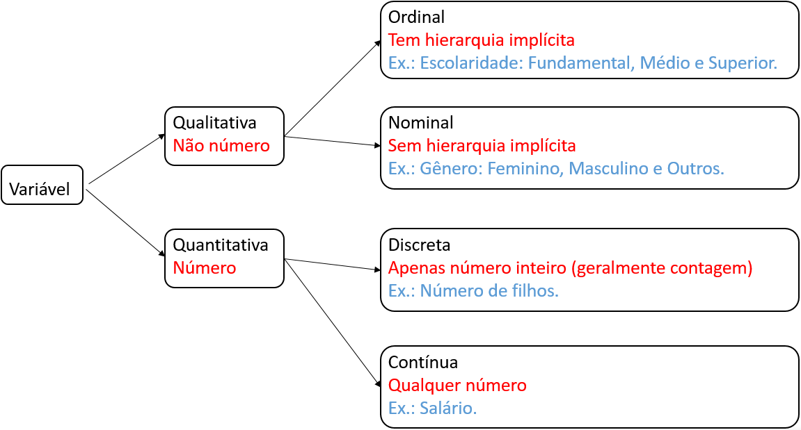
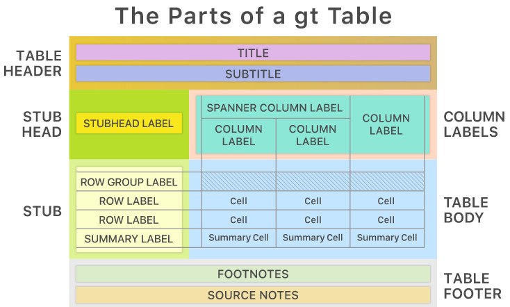
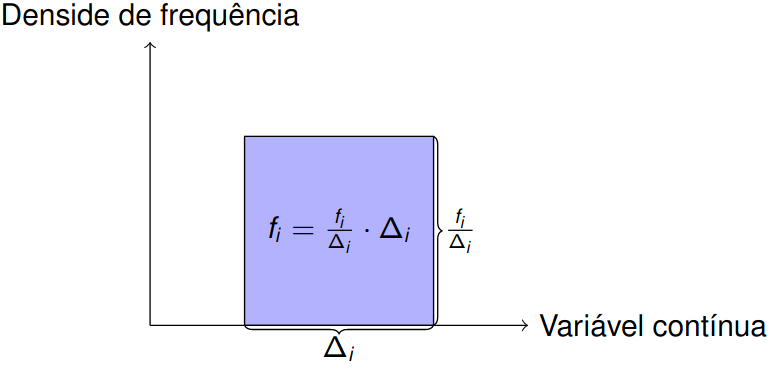
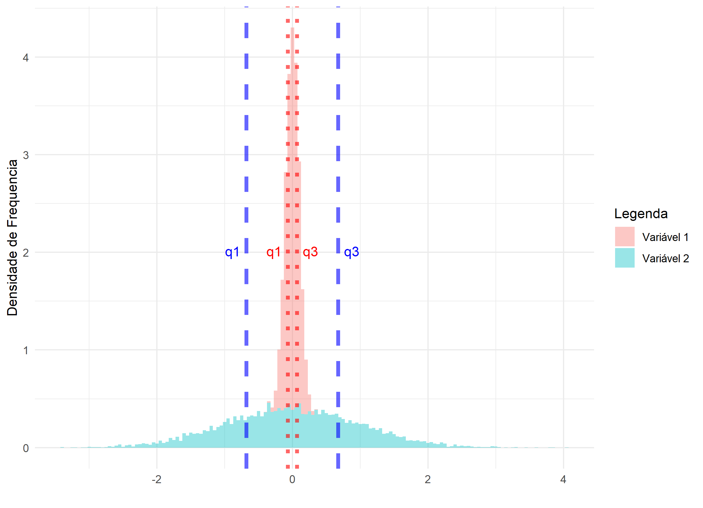
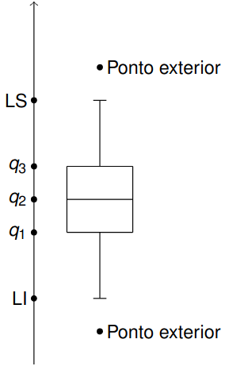

## Conceitos básicos {.smaller}

```{r}
#| echo: false
#| message: false
knitr::opts_chunk$set(echo = TRUE, results = "markup", message = F,
                    comment = "##", fig.align = "center")
library(readxl)
library(writexl)
library(janitor)
library(patchwork)
library(gt)
library(tidyverse)
```

Começamos com alguns conceitos básicos, que usaremos durante todo esse curso.

* **População**: Todos os elementos ou indivíduos alvo do estudo; 
* **Amostra**: Parte da população; 
* **Parâmetro:** característica da população (grandeza); 
* **Estimativa:** característica da amostra. Usamos a estimativa para aproximar o parâmetro; 
* **Variável:** _característica de um elemento da população (idade ou peso)._ Geralmente usamos uma letra maiúscula do alfabeto latino para representar uma variável (idade ou peso), e uma letra minúscula do alfabeto latino para representar o valor de uma variável para um elemento da população. Por exemplo, podemos representar _a variável "idade" por $X$_ e um _x=30 é idade de um elemento da amostra_.

## Classificação de variáveis

```{r}
#| echo: false
#| out.width: 80%
#| fig.align: center
#| fig.cap: Classificação de variáveis.

```

## Tabela de distribuição de frequência <br> variável qualitativa {.smaller}

A primeira coisa que fazemos é contar! 

|$X$|frequência|frequência relativa|porcentagem|
|:---:|:---:|:---:|:---:|
|$B_1$|$n_1$|$f_1$|$100 \cdot f_1\%$|
|$B_2$|$n_2$|$f_2$|$100 \cdot f_2\%$|
|$\vdots$|$\vdots$|$\vdots$|$\vdots$|
|$B_k$|$n_k$|$f_k$|$100 \cdot f_k\%$|
|Total|$n$|$1$|$100\%$|

Em que $n$ é o tamanho da amostra. 

Geralmente não incluímos a coluna de _frequência relativa_.

## (Re)codificação de variáveis

Precisamos usar o dicionário de variáveis para (re)codificar as variáveis.

```{r}
df_base_raw <- read_xlsx("data/raw/base_has.xlsx", na = "NA")
df_base_processed <- df_base_raw |>
  mutate(sex = recode(sex, `1` = "M", `2` = "F"),
      racacor = recode(racacor, `1` = "Branca", `2` = "Preta",
                      `3` = "Indígena", `4` = "Parda"),
      esc = recode(esc, `1` = "Fundamental incompleto", `2` = "Médio completo",
                  `3` = "Superior incompleto", `4` = "Superior completo"))
write_xlsx(df_base_processed, "data/processed/base_has_processed.xlsx")
df_base_processed |> select(racacor, sex, esc) |> head(n = 4)
```

## Tabela de distribuição de frequência <br> variável qualitativa 

**Pacotes:** `janitor`

```{r}
#| eval: false
library(janitor)
df_base_processed |>
    tabyl(sex) |>
    arrange(desc(n)) |>
    adorn_totals() |>
    adorn_pct_formatting(digits = 2) |>
    rename(
        "Gênero" = sex,
        "Frequência" = n,
        "Porcentagem" = percent,
        "Porcentagem sem missing" = valid_percent
    )
```

----

```{r}
#| echo: false
library(janitor)
df_base_processed |>
    tabyl(sex) |>
    arrange(desc(n)) |>
    adorn_totals() |>
    adorn_pct_formatting(digits = 2) |>
    rename(
        "Gênero" = sex,
        "Frequência" = n,
        "Porcentagem" = percent,
        "Porcentagem sem missing" = valid_percent
    )
```

## Tabela de distribuição de frequência <br> variável quantitativa discreta

**Pacotes:** `janitor`

```{r}
#| eval: false
library(janitor)
df_mtcarros <- read_csv2("data/raw/mtcarros.csv")
df_mtcarros |>
    tabyl(marchas) |>
    arrange(desc(n)) |>
    adorn_totals() |>
    adorn_pct_formatting(digits = 2) |>
    rename(
        "Marchas" = marchas,
        "Frequência" = n,
        "Porcentagem" = percent
    )

```

-----

```{r}
#| echo: false
library(janitor)
df_mtcarros <- read_csv2("data/raw/mtcarros.csv")
df_mtcarros |>
    tabyl(marchas) |>
    arrange(desc(n)) |>
    adorn_totals() |>
    adorn_pct_formatting(digits = 2) |>
    rename(
        "Marchas" = marchas,
        "Frequência" = n,
        "Porcentagem" = percent
    )

```

## Tabela de distribuição de frequência <br> variável quantitativa contínua {.smaller}

**Primeiro agregamos os valores em intervalos.**

i. Usamos intervalos usados na área de saúde (outro artigo, por exemplo)
ii. Regra de Sturge: $\lceil 1 + \log_2(n) \rceil$ ($n$ é o tamanho da amostra)

```{r}
k <- round(1 + log2(nrow(df_base_processed)))
faixas <- seq(
    from = min(df_base_processed$ida, na.rm = TRUE),
    to = max(df_base_processed$ida, na.rm = TRUE),
    length.out = k
)
df_base_processed <- df_base_processed |>
    mutate(faixa_idade = cut(
        ida,
        breaks = faixas,
        include.lowest = T,
        right = F
    ))

```

## Tabela de distribuição de frequência <br> variável quantitativa contínua 

```{r}
#| eval: false
df_base_processed |>
    tabyl(faixa_idade) |>
    adorn_totals() |>
    adorn_pct_formatting(digits = 2) |>
    rename(
        "Idade por intervalos" = faixa_idade,
        "Frequência Absoluta" = n,
        "Porcentagem" = percent,
        "Porcentagem sem missing" = valid_percent
    )
```

----

```{r}
#| echo: false
df_base_processed |>
    tabyl(faixa_idade) |>
    adorn_totals() |>
    adorn_pct_formatting(digits = 2) |>
    rename(
        "Idade por intervalos" = faixa_idade,
        "Frequência Absoluta" = n,
        "Porcentagem" = percent,
        "Porcentagem sem missing" = valid_percent
    )
```


# Medidas de Resumo <br><br>Medidas de posição e dispersão

## {.smaller}

A ideia é encontrar um ou alguns valores que sintetizem todos os valores.

**Medidas de posição (tendência central)**

A ideia é encontrar um valor que representa _bem_ todos os valores.

* **Média:**  $\overline{x} = \dfrac{x_1+\cdots+x_n}{n}$
* **Mediana:** valor que divide a sequência ordenada de valores em duas partes iguais.

**Medidas de dispersão**

A ideia é medir a homogeneidade dos valores.

* **Variância: ** $s^2 = \dfrac{(x_1 - \overline{X})^2 + \cdots + (x_n - \overline{X})^2}{n-1}$;
* **Desvio padrão: ** $s = \sqrt{s^2}$ (mesma unidade dos dados);
* **coeficiente de variação** $cv= \dfrac{s}{\overline{x}} \cdot 100\%$ (adimensional, ou seja, "sem unidade")

## Medidas de resumo

**Pacote:** `dplyr`

```{r}
#| eval: false
df_base_processed |>
    group_by(racacor) |>
    summarise(
        media = mean(imc),
        mediana = median(imc),
        variancia = var(imc),
        dp = sd(imc),
        cv = dp / media,
        frequencia = n()
    )

```

----

```{r}
#| echo: false
df_base_processed |>
    group_by(racacor) |>
    summarise(
        media = mean(imc),
        mediana = median(imc),
        variancia = var(imc),
        dp = sd(imc),
        cv = dp / media,
        frequencia = n()
    )
```

## Quantis {.smaller}

### Ideia

$q(p)$ é um valor que satisfaz:

* $100\cdot p\%$ das observações é no máximo $q(p)$
* $100\cdot (1-p)\%$ das observações é no mínimo $q(p)$

### Alguns quantis especiais

* **Primeiro quartil:** $q_1 = q\left(\frac{1}{4}\right)$
* **Segundo quartil:** $q_2 = q\left(\frac{2}{4}\right)$
* **Terceiro quartil:** $q_3 = q\left(\frac{3}{4}\right)$

## Quantis

```{r}
df_base_processed |>
    group_by(sex) |>
    summarise(
        q1 = quantile(imc, 0.25),
        q2 = quantile(imc, 0.5),
        q3 = quantile(imc, 0.75),
        frequencia = n()
    )
```

# Exportando tabelas <br><br>pacote `gt`

## Pacote `gt`

Vamos usar o pacote `gt` para customizar a apresentação de uma tabela. 

A ideia do pacote `gt` é melhorar apresentação por camadas.

```{r}
#| out.width: 50%
#| echo: false

```

Para mais detalhes, visite [`pacote gt`](https://gt.rstudio.com).

## Exemplo

Vamos customizar e salvar a tabela com as medidas de resumo para a variável `imc` do conjunto de dados _base\_.xlsx_.

```{r}
tab <- df_base_processed |>
    filter(!is.na(racacor) & !is.na(imc) & racacor != "Indígena") |>
    group_by(racacor) |>
    summarise(
        media = mean(imc),
        mediana = median(imc),
        dp = sd(imc),
        cv = dp * 100 / media,
        q1 = quantile(imc, 1 / 4),
        q3 = quantile(imc, 3 / 4)
    )
```

## Cabeçalho e subcabeçalho

* `tab_header`: permite incluir cabeçalho (`title`) e subcabeçalho (`subtitle`)
* `gtsave`: permite salvar tabela em formato `html` (página web), `tex` ($\LaTeX$) e `rtf` (word)

```{r}
library(gt)
gt_tab <- gt(tab) |>
  tab_header(
    title = md("**IMC**"),
    subtitle = md("**por raça autodeclarada**")
  )
gtsave(gt_tab, filename = "output/gt_tab.html")
gtsave(gt_tab, filename = "output/gt_tab.tex")
gtsave(gt_tab, filename = "output/gt_tab.rtf")
```

## Incluindo fonte dos dados

* `tab_source_note`: inclusão de _fonte de dados_
* `md`: formatação de texto usando a sintaxe [`markdown`](https://www.markdownguide.org/cheat-sheet)
* `html`: formatação de texto usando sintaxe [`html`](https://www.w3schools.com/html/html_formatting.asp)

```{r, eval=FALSE}
gt_tab <- gt_tab |>
  tab_source_note(
    source_note = md("**Fonte:** Elaboração própria.")
  )
gt_tab
```

---

```{r, echo=FALSE}
gt_tab <- gt_tab |>
  tab_source_note(
    source_note = md("**Fonte:** Elaboração própria.")
  )
gt_tab
```

## Rótulo para grupo de linhas

`tab_row_group`: permite colocar _rótulo_ para um grupo de linhas

```{r, eval=FALSE}
gt_tab <- gt_tab |>
  tab_row_group(
    label = md("**Pessoas negras**"),
    rows = c(2, 3)
  )
gt_tab
```

---

```{r, echo=FALSE}
gt_tab <- gt_tab |>
  tab_row_group(
    label = md("**Pessoas negras**"),
    rows = c(2, 3)
  )
gt_tab
```

## Rótulo para grupo de colunas

`tab_spanner`: permite colocar _rótulo_ para grupo de colunas

```{r, eval=FALSE}
gt_tab <- gt_tab |>
  tab_spanner(
    label = html("<strong>Quantis</strong>"),
    columns = c(q1, mediana, q3)
  )
gt_tab
```
---

```{r, echo=FALSE}
gt_tab <- gt_tab |>
  tab_spanner(
    label = html("<strong>Quantis</strong>"),
    columns = c(q1, mediana, q3)
  )
gt_tab
```

## Movendo colunas {.smaller}

* `col_move_to_start`: move uma ou mais colunas para o início da tabela
* `col_move_to_end`: move uma ou mais colunas para o fim da tabela
* `col_move`: move uma coluna ou mais colunas depois uma determinada coluna

```{r}
#| eval: false
gt_tab <- gt_tab |>
    cols_move_to_start(
        columns = racacor
    ) |>
    cols_move_to_end(
        columns = c(q1, mediana, q3)
    ) |>
    cols_move(
        columns = cv,
        after = media
    )
gt_tab
```

---

```{r}
#| echo: false
gt_tab <- gt_tab |>
    cols_move_to_start(
        columns = racacor
    ) |>
    cols_move_to_end(
        columns = c(q1, mediana, q3)
    ) |>
    cols_move(
        columns = cv,
        after = media
    )
gt_tab
```

## Atualização dos rótulos das colunas

`cols_label`: permite atualizar os _rótulos_ de colunas

```{r}
#| eval: false
gt_tab <- gt_tab |>
    cols_label(
        racacor = md("_Raça_"),
        media = html("<em>Média</em>"),
        cv = md("_Coeficiente de variação_"),
        dp = html("<em>Desvio padrão</em>"),
        q1 = md("_Primeiro quartil_"),
        mediana = html("<em>Segundo quartil</em>"),
        q3 = md("_Terceiro quartil_")
    )
gt_tab
```

---

```{r}
#| echo: false
gt_tab <- gt_tab |>
    cols_label(
        racacor = md("_Raça_"),
        media = html("<em>Média</em>"),
        cv = md("_Coeficiente de variação_"),
        dp = html("<em>Desvio padrão</em>"),
        q1 = md("_Primeiro quartil_"),
        mediana = html("<em>Segundo quartil</em>"),
        q3 = md("_Terceiro quartil_")
    )
gt_tab
```

## Formatação de valores nas colunas

`fmt_number:` formatação de valores numéricos em uma tabela

```{r}
#| eval: false
gt_tab <- gt_tab |>
    fmt_number(
        columns = c(media, mediana, dp, q1, q3),
        decimals = 2,
        dec_mark = ",",
        sep_mark = "."
    ) |>
    fmt_number(
        columns = cv,
        decimals = 2,
        dec_mark = ",",
        sep_mark = ".",
        pattern = "{x}%"
    )
gt_tab
```

---

```{r}
#| echo: false
gt_tab <- gt_tab |>
    fmt_number(
        columns = c(media, mediana, dp, q1, q3),
        decimals = 2,
        dec_mark = ",",
        sep_mark = "."
    ) |>
    fmt_number(
        columns = cv,
        decimals = 2,
        dec_mark = ",",
        sep_mark = ".",
        pattern = "{x}%"
    )
gt_tab
```

# Gráficos <br><br>`ggplot2`

## Gráficos no `R` {.smaller}

* **Pacote:** `ggplot2` 
* Permite gráficos personalizados com uma sintaxe simples e rápida, e iterativa _por camadas_
* Começamos com um camada com os dados `ggplot(dados)`, e vamos adicionando as camadas de anotações, e sumários estatísticos
* Usa a _gramática de gráficos_ proposta por Leland Wilkinson: [Grammar of Graphics](https://www.springer.com/gp/book/9780387245447)
* Ideia desta gramática: delinear os atributos estéticos das figuras geométricas (incluindo transformações nos dados e mudança no sistema de coordenadas)

* Para mais detalhes, você pode consultar [`ggplot2`: elegant graphics for data analysis](https://ggplot2-book.org) e [documentação do `ggplot2`](https://ggplot2.tidyverse.org)

## Estrutura básica `ggplot2` {.smaller}

```r
#| eval: false
ggplot(data = <data possible tibble>) +
  <Geom functions>(mapping = aes(<MAPPINGS>)) +
  <outras camadas>
```

Você pode usar diversos temas e extensões que a comunidade cria e criou para melhorar a aparência e facilitar a construção de `ggplot2`.

* Lista com extensões do `ggplot`: [extensões do `ggplots`](https://exts.ggplot2.tidyverse.org/gallery/)

Indicação de extensões:

* Temas adicionais para o pacote `ggplot2`: [`ggthemes`](https://jrnold.github.io/ggthemes/index.html)
* Gráfico de matriz de correlação: [`ggcorrplot`](https://rpkgs.datanovia.com/ggcorrplot/)
* Gráfico quantil-quantil: [`qqplotr`](https://aloy.github.io/qqplotr/)

## Gráfico de barras {.smaller}

#### Gráfico de Barras no `ggplot2`

* **função:** `geom_bar()`. Para porcentagem: `geom_bar(x = <variável no eixo x>, y = ..prop.. * 100)`.
* Argumentos adicionais:  
  * **`fill`**: mudar a cor do preenchimento das figuras geométricas
  * **`color`**: mudar a cor da figura geométrica

#### Rótulos dos eixos

* **Mudar os rótulos:** `labs(x = <rótulo do eixo x>, y = <rótulo do eixo y>, title = <legenda do gráfico>)`
* **Trocar o eixo-x pelo eixo-y:** `coord_flip()`

#### Salvar gráficos

* `ggsave()`: salvar gráficos nos formatos `pdf`, `png` e `jpeg`

## Gráfico de barras

```{r}
#| eval: false
library(ggplot2)
library(ggthemes)
ggplot(df_base_processed) +
    geom_bar(aes(x = sex), fill = "blue", color = "red") +
    labs(x = "Gênero", y = "Frequência absoluta") +
    theme_gdocs()
ggsave("figures/barras.jpeg")
ggsave("figures/barras.png")
ggsave("figures/barras.pdf")
```

---

```{r}
#| echo: false
library(ggplot2)
library(ggthemes)
ggplot(df_base_processed) +
    geom_bar(aes(x = sex), fill = "blue", color = "red") +
    labs(x = "Gênero", y = "Frequência absoluta") +
    theme_gdocs()
ggsave("figures/barras.jpeg")
ggsave("figures/barras.png")
ggsave("figures/barras.pdf")
```

## Histograma {.smaller}

Para variávieis quantitativas contínuas usamos _histograma_. 

* O histograma é um gráfico de barras contíguas em que a área de cada barra é igual à frequência relativa.
* Cada faixa de valor $[l_{i-1}, l_{i}), i=1, \dots, n,$ será representada por um barra com área $f_i, i=1, \dots, n$.
* Como cada barra terá área igual a $f_i$ e base $\Delta_i = l_i - l_{i-1}$, e a altura de cada barra será $\frac{f_i}{l_i - l_{i-1}}$.
* $\frac{f_i}{l_i - l_{i-1}}$ é denominada de densidade de frequência.
* Podemos fornecer:
    * `bins`: número de intervalos
    * `binwidth`: tamanho dos intervalos
    * `breaks`: limites dos intervalos

## Histograma

```{r}
#| echo: false
#| out.width: 85%

```

## Histograma

```{r}
#| eval: false
k <- round(1 + log2(nrow(df_base_processed)))

ggplot(df_base_processed) +
  geom_histogram(aes(x = imc, y = ..density..),
                bins = k, fill = "blue", closed = "left") +
  theme_gdocs() +
  labs(
    x = "IMC",
    y = "Densidade de frequência",
    title = "Histograma"
  )
```

----

```{r}
#| echo: false
k <- round(1 + log2(nrow(df_base_processed)))

ggplot(df_base_processed) +
  geom_histogram(aes(x = imc, y = ..density..),
                bins = k, fill = "blue", closed = "left") +
  theme_gdocs() +
  labs(
    x = "IMC",
    y = "Densidade de frequência",
    title = "Histograma"
  )
```

## Diagrama de caixa {.smaller}

**medida de dispersão:** distância entre $q_1$ e $q_3$ pequena indica homogeneidade

**Diferença de quartis:** $dq = q_3 - q_1$

```{r}
#| echo: false
#| out.width: 50%

```

## Diagrama de caixa

```{r}
#| echo: false
#| out.width: 25%

```

## Diagrama de caixa {.smaller}

**Assimetria**

```{r}
#| echo: false
#| out.heigth: 100%
tam <- 1000
k <- ceiling(1 + log2(tam))
a <- 1
b <- 15
#------------------------------------------------------------------------------
# assimetria positiva
amostra <- rbeta(tam, shape1 = a, shape2 = b)
p1 <- ggplot(tibble(x = amostra)) +
    geom_histogram(aes(x = x, y = ..density..), 
                    bins = k, fill = "blue") +
    theme_gdocs() +
    scale_x_continuous(breaks = NULL) +
    scale_y_continuous(breaks = NULL) +
    labs(x = "X", y = "Densidade de\n frequência",
        title = "Assimetria à direita ou positiva") +
    theme(
      title = element_text(size = 7.5)
    )

p2 <- ggplot(tibble(x = amostra)) +
    geom_boxplot(aes(x = "", y = x), outlier.shape = NA) +
    theme_calc() +
    scale_x_discrete(breaks = NULL) +
    scale_y_continuous(breaks = NULL) +
    labs(x = "", y = "X", title = "Assimetria à direira ou positiva")

#------------------------------------------------------------------------------
# assimetria negativa
amostra <- rbeta(tam, shape1 = b, shape2 = a)
n1 <- ggplot(tibble(x = amostra)) +
    geom_histogram(aes(x = x, y = ..density..), 
                    bins = k, fill = "blue") +
    theme_gdocs() +
    scale_x_continuous(breaks = NULL) +
    scale_y_continuous(breaks = NULL) +
    labs(x = "X", y = "Densidade de\n frequência",
        title = "Assimetria à esquerda ou negativa") +
    theme(
      title = element_text(size = 7.5)
    )

n2 <- ggplot(tibble(x = amostra)) +
    geom_boxplot(aes(x = "", y = x), outlier.shape = NA) +
    theme_calc() +
    scale_x_discrete(breaks = NULL) +
    scale_y_continuous(breaks = NULL) +
    labs(x = "", y = "X",
        title = "Assimetria à esquerda ou negativa")

#------------------------------------------------------------------------------
# simetria
amostra <- rbeta(tam, shape1 = 5, shape2 = 5)
s1 <- ggplot(tibble(x = amostra)) +
    geom_histogram(aes(x = x, y = ..density..), 
                    bins = k, fill = "blue") +
    theme_gdocs() +
    scale_x_continuous(breaks = NULL) +
    scale_y_continuous(breaks = NULL) +
    labs(x = "X", y = "Densidade de\n frequência",
        title = "Simetria") +
    theme(
      title = element_text(size = 7.5)
    )

s2 <- ggplot(tibble(x = amostra)) +
    geom_boxplot(aes(x = "", y = x), outlier.shape = NA) +
    theme_calc() +
    scale_x_discrete(breaks = NULL) +
    scale_y_continuous(breaks = NULL) +
    labs(x = "", y = "X",
        title = "Simetria")

p1 + p2 + n1 + n2 + s1 + s2 + plot_layout(nrow = 3, byrow =  T)
```

## Diagrama de caixa

```{r}
#| out.width: 55%
ggplot(df_base_processed) +
  geom_boxplot(aes(x = "", y = imc)) +
  labs(x = "", y = "IMC", title = "Boxplot") +
  theme_gdocs()
```

## Gráficos lado a lado com `patchwork`

* `patchwork` permite colocar gráficos lado a lado com os operadores binários `+` (ao lado) e `\` (embaixo)
* Mais detalhes em [documentação `patchwork`](https://patchwork.data-imaginist.com/articles/patchwork.html)

```{r}
#| eval: false
g1 <- ggplot(df_base_processed) +
  geom_boxplot(aes(x = "", y = pes)) +
  labs(x = "", y = "Peso (kg)", title = "Boxplot") +
  theme_gdocs()
g2 <- ggplot(df_base_processed) +
  geom_boxplot(aes(x = "", y = alt)) +
  labs(x = "", y = "Altura (cm)", title = "Boxplot") +
  theme_gdocs()
g1 + g2
```

---

```{r}
#| echo: false
g1 <- ggplot(df_base_processed) +
  geom_boxplot(aes(x = "", y = pes)) +
  labs(x = "", y = "Peso (kg)", title = "Boxplot") +
  theme_gdocs()
g2 <- ggplot(df_base_processed) +
  geom_boxplot(aes(x = "", y = alt)) +
  labs(x = "", y = "Altura (cm)", title = "Boxplot") +
  theme_gdocs()
g1 + g2
```

# Gráficos<br><br>Duas variáveis

## Gráfico de dispersão

**Ideia:** estudar a associação entre duas variáveis quantitativas

```{r}
#| echo: false
#| out.width: 75%
library(patchwork)
library(mvtnorm)
tam <- 1000
m_positiva <- rmvnorm(tam, mean = c(0,0), sigma = cbind(c(1, 0.95), c(0.95, 1)))
g1 <- ggplot(tibble(x = m_positiva[, 1], y = m_positiva[, 2])) +
  geom_point(aes(x, y)) +
  theme_calc() +
  scale_x_continuous(breaks = NULL) +
  scale_y_continuous(breaks = NULL) +
  labs(title = "Associação positiva")

m_negativa <- rmvnorm(tam, mean = c(0,0), sigma = cbind(c(1, -0.95), c(-0.95, 1)))
g2 <- ggplot(tibble(x = m_negativa[, 1], y = m_negativa[, 2])) +
  geom_point(aes(x, y)) +
  theme_calc() +
  scale_x_continuous(breaks = NULL) +
  scale_y_continuous(breaks = NULL) +
  labs(title = "Associação negativa")

m_nulo <- rmvnorm(tam, mean = c(0,0), sigma = cbind(c(1, 0), c(0, 1)))
g3 <- ggplot(tibble(x = m_nulo[, 1], y = m_nulo[, 2])) +
  geom_point(aes(x, y)) +
  theme_calc() +
  scale_x_continuous(breaks = NULL) +
  scale_y_continuous(breaks = NULL) +
  labs(title = "Associação nula")

g1 + g2 + g3
```

## Gráfico de dispersão

```{r}
#| eval: false
ggplot(df_base_processed) +
  geom_point(aes(pes, imc)) +
  labs(
    x = "Peso (kg)",
    y = "IMC",
    title = "Gráfico de dispersão"
  ) +
  theme_gdocs()
```

---

```{r}
#| echo: false
ggplot(df_base_processed) +
  geom_point(aes(pes, imc)) +
  labs(
    x = "Peso (kg)",
    y = "IMC",
    title = "Gráfico de dispersão"
  ) +
  theme_gdocs()
```

## Gráfico de barras {.smaller}

**Ideia**

Sejam $X$ e $Y$ duas variáveis qualitativas com seguintes valores possíveis

* $X$: $A_1, \dots, A_r$
* $Y$. $B_1, \dots, B_s$

Desejamos estudar  a associação entre $X$ e $Y$.

**Associação entre $X$ e $Y$**

Suponha que $A_i$ tenha porcentagem $f_i\cdot 100\%$. Então, $X$ e $Y$ são:

* **não associados** se ao conhecermos o valor de $Y$ para um elemento da população, _continuamos_ com a porcentagem $100\cdot f_i \%$ deste elemento ter valor de $X$ igual a $A_i$
* **associados** se ao conhecermos o valor de $Y$ para um elemento da população, _alteramos_ a porcentagem $100\cdot f_i\%$ deste elemento ter valor de $X$ igual a $A_i$

## Gráfico de barras

```{r}
#| eval: false
df_filtrada <- df_base_processed |>
  filter(racacor != "Indígena" & !is.na(racacor) & !is.na(esc))
ggplot(df_filtrada) +
  geom_bar(aes(x = racacor, fill = esc), position = "fill") +
  labs(x = "Raça", y = "Porcentagem") +
  scale_y_continuous(labels = scales::percent)+
  scale_fill_manual(name = "Escolaridade", values = c("blue", "orange", "magenta", "brown")) +
  theme_gdocs()
```

---

```{r}
#| echo: false
df_filtrada <- df_base_processed |>
  filter(racacor != "Indígena" & !is.na(racacor) & !is.na(esc))
ggplot(df_filtrada) +
  geom_bar(aes(x = racacor, fill = esc), position = "fill") +
  labs(x = "Raça", y = "Porcentagem") +
  scale_y_continuous(labels = scales::percent)+
  scale_fill_manual(name = "Escolaridade", values = c("blue", "orange", "magenta", "brown")) +
  theme_gdocs()
```

## Gráfico de barras 

Podemos agrupar as barras por grupos para analisar a associação entre duas variáveis qualitativas.

```{r}
#| eval: false
df_filtrada <- df_base_processed |>
  filter(racacor != "Indígena" & !is.na(racacor) & !is.na(esc))
ggplot(df_filtrada) +
  geom_bar(aes(x = racacor, fill = esc), position = "dodge") +
  labs(x = "Raça", y = "Porcentagem") +
  scale_y_continuous(labels = scales::percent)+
  scale_fill_manual(name = "Escolaridade", values = c("blue", "orange", "magenta", "brown")) +
  theme_gdocs()
```

---

```{r}
#| echo: false
df_filtrada <- df_base_processed |>
  filter(racacor != "Indígena" & !is.na(racacor) & !is.na(esc))
ggplot(df_filtrada) +
  geom_bar(aes(x = racacor, fill = esc), position = "dodge") +
  labs(x = "Raça", y = "Porcentagem") +
  scale_y_continuous(labels = scales::percent)+
  scale_fill_manual(name = "Escolaridade", values = c("blue", "orange", "magenta", "brown")) +
  theme_gdocs()
```

## Diagrama de caixa

Podemos comparar medianas de diferentes grupos usando o diagrama de caixa.

```{r}
#| eval: false
df_filtrada <- df_base_processed |>
  filter(racacor != "Indígena" & !is.na(racacor) & !is.na(imc))
ggplot(df_filtrada) +
  geom_boxplot(aes(x = racacor, y = imc)) +
  labs(x = "Raça", y = "IMC") +
  theme_gdocs()
```

---

```{r}
#| echo: false
df_filtrada <- df_base_processed |>
  filter(racacor != "Indígena" & !is.na(racacor) & !is.na(imc))
ggplot(df_filtrada) +
  geom_boxplot(aes(x = racacor, y = imc)) +
  labs(x = "Raça", y = "IMC") +
  theme_gdocs()
```