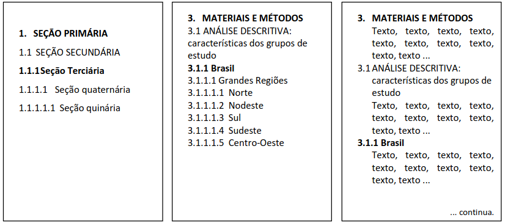
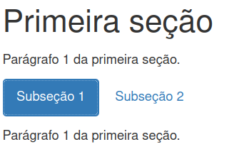

```{r setup, include=FALSE}
knitr::opts_chunk$set(echo = FALSE, out.width = "100%")
library(glue)
library(readxl)
library(writexl)
library(janitor)
library(gt)
library(ggthemes)
library(readODS)
library(patchwork)
library(statBasics)
library(tidyverse)


knitr::opts_chunk$set(echo = TRUE, results = "markup", fig.align = "center",
                       cache = FALSE, fig.height = 3)
```

## Preparando o ambiente

\textbf{\large Durante o curso}

* Usaremos nas aulas: [posit.cloud](https://posit.cloud/).
* Recomendamos instalar e usar `R` com versão pelo menos `4.1`: [cran.r-project.org](https://cran.r-project.org).
* usaremos o _framework_ [`tidyverse`](https://www.tidyverse.org):
  * Instalação: `install.packages("tidyverse")`

\rule{\textwidth}{0.5pt}

\textbf{\large Na sua casa}

* **IDE** recomendadas: [_RStudio_](https://www.rstudio.com/products/rstudio/download/preview/) e [_VSCode_](https://code.visualstudio.com).
  * Caso você queira usar o [_VSCode_](https://code.visualstudio.com), instale a extensão da linguagem `R`: [`REditorSupport`](https://marketplace.visualstudio.com/items?itemName=REditorSupport.r).
* Outras linguagens interessantes: [`python`](https://www.python.org) e [`julia`](https://julialang.org).
  * [`python`](https://www.python.org): linguagem interpretada de próposito geral, contemporânea do `R`,  simples e fácil de aprender.
  * [`julia`](https://julialang.org): linguagem interpretada para análise de dados, lançada em 2012, promete simplicidade e velocidade.

## Onde estudar sozinho

Este curso é apenas o começo!\newline \colorbox{cabecalho}{\textcolor{titulo}{Você vai ter que estudar sozinho para avançar mais...}}

Para usar o pacote `rmarkdown`, você precisa ter:

* conhecimento básico da linguagem `R`
* conhecimento básico da linguagem `latex`
* conhecimento básico da linguagem `markdown`

## Onde estudar sozinho

**`R`**

* [Zen do `R`](https://curso-r.github.io/zen-do-r/)
* [`R` for Datascience](https://r4ds.had.co.nz/)
* [eco`R`](http://ecor.ib.usp.br/doku.php)

\textbf{\LaTeX}

* [Learn \LaTeX\ in 30 minutes](https://pt.overleaf.com/learn/latex/Learn_LaTeX_in_30_minutes)
* [Detexify](https://detexify.kirelabs.org/classify.html)
* [Learn \LaTeX\ with Wikibooks](https://en.wikibooks.org/wiki/LaTeX)

**`markdown`**

* [Tutorial de `markdown` da Microsoft](https://code.visualstudio.com/docs/languages/markdown)
* [Tutorial de `markdown` da Mozilla](https://developer.mozilla.org/pt-BR/docs/MDN/Writing_guidelines/Howto/Markdown_in_MDN)
* [`markdown` Basics](https://quarto.org/docs/authoring/markdown-basics.html)

---

**`rmakdown`**

* [`rmarkdown`: The Definitive Guide](https://bookdown.org/yihui/rmarkdown/)
* [`bookdown`: Authoring Books and Technical Documents with `rmarkdown`](https://bookdown.org/yihui/bookdown/)
* [`blogdown`: Creating Websites with `rmarkdown`](https://bookdown.org/yihui/blogdown/)

## Pacotes da linguagem `R` deste curso

* `rmarkdown`
* `blogdown`
* `bookdown`
* `readxl`
* `writexl`
* `janitor`
* `patchwork`
* `prettydoc`
* `glue`
* `ggthemes`
* `gt`
* `rticles`
* `tidyverse`

# A linguagem `R`

## Sobre a linguagem `R`

**A precursora da linguagem `R`: `S`.**

* `R` é uma linguagem derivada da `S`.
* `S` foi desenvolvido em `fortran` por **John Chambers** em 1976 no **Bell Labs**.
* `S` foi desenvolvida para realizar análise estatística de dados.
* Filosofia do `S`: permitir que usuários possam analisar dados usando estatística com pouco conhecimento de programação.

\regrafina

**História da linguagem `R`**

* Em 1991, **Ross Ihaka** e **Robert Gentleman** criaram o `R` na Nova Zelândia.
* Em 1996, **Ross** e **Robert** liberam o `R` sob a licença "GNU General License", o que tornou o `R` um software livre.
* Em 1997, The Core Group é criado para melhorar e controlar o código fonte do `R`.

# `markdown`

## `markdown`

* Criado em 2004 por **John Gruber**.
* Criado iniciado para textos para internet.
* **Ideia:** fácil de escrever, fácil de ler e entender o código, e permitir edição em forma de prosa. Foco no conteúdo e não nos detalhes da linguagem.
* `markdown` foi inspirada pela formatação permitida ao escrever e-mails.
* `markdown` é portável.
* Não depende de versões como `Microsfot Word`.
* Uso amplamente disseminado, com versões adotadas em aplicativos como: WhatsApp, Notion, GitHub, Stack Overflow, entre outros.

`rmarkdown` and `quarto` usam `pandoc` para converter código `markdown` para os formatos `HTML`, `pdf` e `docx`.

## `markdown`\newline Sintaxe básica

Seções (e subseções) são partes que dividem um texto de acordo com conteúdo afins.

Para mais detalhes, consulte [Seções e subseções de acordo com NBR 6024/2012](https://www.bccl.unicamp.br/wp-content/uploads/2020/08/Manual-de-numera%C3%A7%C3%A3o-progressiva-das-secoes-de-um-documento_BCCL.pdf).

```{r}
#| echo: false
#| out.width: 75%

```

## `markdown`\newline Sintaxe básica

Podemos definir seções e subseções com `#`.

\colorbox{cabecalho}{\textcolor{titulo}{O caractere \texttt{\#} precisa estar na primeira coluna da linha.}}\newline
\colorbox{cabecalho}{\textcolor{titulo}{É necessário incluir um único espaço depois de \texttt{\#}.}}

|código `markdown`|código `HTML`|código \LaTeX|
|:---|:---|:---|
|`# texto`|`<h1>texto</h1>`| `\section{texto}`|
|`## texto`|`<h2>texto</h2>`| `\subsection{texto}`|
|`### texto`|`<h3>texto</h3>`| `\subsubsection{texto}`|
|`#### texto`|`<h4>texto</h4>`| `\paragraph{texto}`|
|`##### texto`|`<h5>texto</h5>`| `\subparagraph{texto}`|
|`###### texto`|`<h6>texto</h6>`|  |

## `markdown`\newline Sintaxe básica

**Parágrafos**

Para criar parágrafos, separa blocos de linhas com um (ou mais) linhas em branco.

|código `markdown`|código `HTML`|código \LaTeX|
|:---|:---|:---|
|`Primeira linha.` |`<p>Primeira linha.</p>`| `Primeira linha.`|
||`<p>Segunda linha.</p>`||
|`Segunda linha.`||`Segunda linha.`|

**Não inclua tabs ou espaços na primeira linha de parágrafos.**

## `markdown`\newline Sintaxe básica

**Formatação de texto**

\scriptsize

|Descrição|código `markdown`|código `HTML`|código \LaTeX|Resultado|
|:-----|:---|:---|:---|:--:|
|Itálico|`*Itálico*`|`<em>Itálico</em>`| `\textit{Itálico}`|*Itálico*|
|Negrito|`**Negrito**`|`<strong>Negrito</strong>`| `\textbf{Negrito}`|**Negrito**|
|Tachado|`~~Tachado~~`|`<s>Tachado</s>`||~~Tachado~~|
|Sobrescrito|`x^2^`|`x<sup>2</sup>`||x^2^|
|Subscrito|`t~0~`|`t<sub>0</sub>`||t~0~|


\normalsize

Podemos ter um texto em negrito e em itálico:

```markdown
***Negrito e Itálico***
```

## `markdown`\newline Sintaxe básica

**Bloco de citação**

Na primeira linha do parágrafo, inclua `>`.

**Exemplo de código**

```markdown
> Isto é uma citação.
```

**Resultado**

\hfill\break

> Isto é uma citação.

## `markdown`\newline Sintaxe básica

**Bloco de citação com múltiplos parágrafos**

Adicione `>` em cada parágrafo e nos espaços em branco entre os parágrafos.

**Exemplo de código**

```markdown
> Primeira linha do bloco de citação.
>
> Segunda linha do bloco de citação.
```

**Resultado**

\hfill\break

> Primeira linha do bloco de citação.
>
> Segunda linha do bloco de citação.

## `markdown`\newline Sintaxe básica

**Bloco de citação** pode ter todos os outros elementos `markdown`.

**Exemplo**

```markdown
> ### Um lindo bloco de citação
> Primeiro parágrafo tem **negrito**.
>
> Segundo parágrafo tem *Itálico*.
>
> Terceiro Páragrafo tem ***Negrito e Itálico***.
```

**Resultado**

> ### Um lindo bloco de citação
> Primeiro parágrafo tem **negrito**.
>
> Segundo parágrafo tem *Itálico*.
>
> Terceiro Páragrafo tem ***Negrito e Itálico***.

## `markdown`\newline Sintaxe básica

**Listas ordenadas**

As listas ordenadas devem começar com o número `1` (ou `i.`).

\small

|código `markdown`|código `HTML`|código \LaTeX|
|:---|:---|:---|
|`1. Primeiro item`|`<ol>`| `\begin{enumerate}`|
|`8. Segundo item`|\quad`<li>Primeiro item</li>`|\quad `\item Primeiro item`|
|`1. Terceiro item`|\quad`<li>Segundo item</li>`|\quad `\item Segundo item`|
||\quad`<li>Terceiro item</li>`|\quad `\item Terceiro item`|
||`</ol>`| `\end{enumerate}`|

\normalsize

**Resultado**

1. Primeiro item
8. Segundo item
1. Terceiro item

## `markdown`\newline Sintaxe básica

**Listas não ordenadas**

As listas não ordenadas começam com: `-`, `*` ou `+`.

\small

|código `markdown`|código `HTML`|código \LaTeX|
|:---|:---|:---|
|`+ Primeiro item`|`<ul>`| `\begin{itemize}`|
|`+ Segundo item`|\quad`<li>Primeiro item</li>`|\quad `\item Primeiro item`|
|`+ Terceiro item`|\quad`<li>Segundo item</li>`|\quad `\item Segundo item`|
||\quad`<li>Terceiro item</li>`|\quad `\item Terceiro item`|
||`</ul>`| `\end{itemize}`|

\normalsize

**Resultado**

+ Primeiro item
+ Segundo item
+ Terceiro item

## `markdown`\newline Sintaxe básica

**Listas aninhadas**

Indente as listas que estão dentro de outras listas com dois espaços.

\scriptsize

|código `markdown`|código `HTML`|código \LaTeX|
|:---|:---|:---|
|`+ Item 1`|`<ul>`| `\begin{itemize}`|
|\quad`+ Item 1 interno`|\quad`<li>Item 1</li>`|\quad `\item Item 1`|
|\quad`+ Item 2 interno`|\quad`<ul>`|\quad `\begin{itemize}`|
|`+ Item 2`|\quad\quad`<li>Item 1 interno</li>`|\quad\quad `\item Item 1 interno`|
||\quad\quad`<li>Item 2 interno</li>`|\quad\quad `\item Item 2 interno`|
||\quad`</ul>`|\quad `\end{itemize}`|
||\quad`<li>Item 2</li>`|\quad `\item Item 2`|
||`</ul>`| `\end{itemize}`|

\normalsize

**Resultado**

* Item 1
  + Item 1
  + Item 2
* Item 2

## `markdown`\newline Sintaxe básica

**Listas aninhadas**

Indente as listas que estão dentro de outras listas com dois espaços.

\scriptsize

|código `markdown`|código `HTML`|código \LaTeX|
|:---|:---|:---|
|`+ Item 1`|`<ul>`| `\begin{itemize}`|
|\quad`1. Item 1 interno`|\quad`<li>Item 1</li>`|\quad `\item Item 1`|
|\quad`1. Item 2 interno`|\quad`<ol>`|\quad `\begin{enumerate}`|
|`+ Item 2`|\quad\quad`<li>Item 1 interno</li>`|\quad\quad `\item Item 1 interno`|
||\quad\quad`<li>Item 2 interno</li>`|\quad\quad `\item Item 2 interno`|
||\quad`</ol>`|\quad `\end{enumerate}`|
||\quad`<li>Item 2</li>`|\quad `\item Item 2`|
||`</ul>`| `\end{itemize}`|

\normalsize

**Resultado**

+ Item 1
  1. Item 1
  1. Item 2
+ Item 2

## `markdown`\newline Sintaxe básica

**Código fonte (sem inclusão do resultado)**

Para inclusão de código *inline* (dentro de uma frase): `` `print("olá mundo!")` ``.

**Exemplo**

```markdown
Um texto com código `print(1 + 2)`.
```

**Resultado**

Um texto com código `print(1 + 2)`.

--- 

Para inclusão de código *em bloco*, use `` ``` ``.

**Exemplo**

Podemos substituir `r` por: `python`, `html`, `julia` entre outros.

`` ```r ``\newline
`print("Olá mundo!")`\newline
`print(1 + 2)`\newline
`` ``` ``

**Resultado**

```r
print("Olá mundo")
print(1 + 2)
```

Para ver a lista de linguagens compatíveis consulte: [linguagens compatíveis com `markdown`](https://github.com/jgm/skylighting/tree/master/skylighting-core/xml).

## `markdown`\newline Sintaxe básica

**Tabelas**

`markdown` usa tabelas conhecidas como `pipe table` que tem a seguinte sintaxe:

* As colunas são separadas por `|`.
* A primeira linha contém cabeçalho das colunas.
* A segunda linha contém o alinhamento:
  * `-----` (default) valores serão alinhados à esquerda
  * `----:` valores serão alinhados à direita
  * `:----` valores serão alinhados à esquerda
  * `:---:` valores ficarão centralizados
* A partir da terceira linha, incluimos as informações
* Incluímos a legenda da tabela depois de incluirmos todas as linhas

---

\destaque{As células de uma \textit{pipe table} \textbf{não} podem conter:} 
\begin{itemize}
    \item \destaque{parágrafos}
    \item \destaque{listas}
    \item \destaque{valor em múltiplas linhas}
\end{itemize}

Gerador de tabelas `markdown`: [tablesgenerator.com/markdown_tables](https://www.tablesgenerator.com/markdown_tables).

---

**Exemplo**

\scriptsize

```markdown
| default | alinhamento à esquerda | alinhamento à direita | centralizado |
|---------|:-----|------:|:------:|
|12|12|12|12|
|123|123|123|123|
|1|1|1|1|

: Legenda da tabela.
```

\normalsize

**Resultado**

| default | alinhamento à esquerda | alinhamento à direita | centralizado |
|---------|:-----|------:|:------:|
|12|12|12|12|
|123|123|123|123|
|1|1|1|1|

: Legenda da tabela.

## `markdown`\newline Sintaxe básica

**Links e imagens**

A sintaxe básica para links é `[texto do link](endereço do link)`, onde:

* `texto do link` é um texto descritivo para o link
* `endereço do link` é o endereço para redirecionamento

**Exemplo:**

```markdown
[Google](https://www.google.com.br)
```

**Resultado:**

[Google](https://www.google.com.br)

\regrafina

Se ***`texto do link`*** é igual a ***`endereço do link`***, você pode usar: 

```markdown
<https://www.google.com.br>
```

## `markdown`\newline Sintaxe básica

**Links e imagens**

A sintaxe básica para links é ``, onde:

* `texto da imagem` é um texto descritivo da imagem
* `endereço da imagem` é *filename* da imagem 

\destaque{A imagem precisa estar dentro do mesmo diretório que o arquivo \texttt{.Rmd}.}

**Exemplo**

```markdown

```

---

**Resultado**


## `markdown`\newline Sintaxe básica

**Exemplo** 

* Vamos analisar um documento simples usando `markdown`.
* Por hora, ignore as primeiras linhas delimitadas `---`.

[Exemplo com sintaxe](https://ufbabr-my.sharepoint.com/:u:/g/personal/gilberto_sassi_ufba_br/EVkS8aZN8rZDqXEJXXVFWzIBfkqMGhKClWZ5Mbmiv6vh4g?e=apQKvV){target="_blank"}

## `markdown`\newline Sintaxe básica

**Exercício** 

\small

Use [loremipsum.io](https://loremipsum.io/){target="_blank"} para criar um texto `html`.

Inclua:

* o texto precisa ter 6 parágrafos
* uma citação de sua preferência
* texto negrito, texto itálico, texto tachado, e texto tachado e negrito
* inclua uma lista de itens que você gosta 
* inclua a seguinte tabela com as colunas centralizadas
* inclua um link para o website do nosso curso [rmarkdown.simple.ink](https://rmarkdown.simple.ink){target="_blank"}
* inclua o logo rmarkdown ao final do arquivo (o arquivo na pasta `figuras`)

|Cidade|População|
|:---|---:|
|São Paulo| 11.451.245|
|Rio de Janeiro|6.211.423|
|Brasília|2.817.068|
|Fortaleza|2.428.678|
|Salvador|2.418.005|

\normalsize

# Equações usando \LaTeX

## Expressões matemáticas usando \LaTeX

\texttt{rmarkdown} e \texttt{quarto} usam \href{https://en.wikibooks.org/wiki/LaTeX}{\LaTeX}\ para composição tipográfica de equações matemáticas.

Existem dois tipos de inclusão de equações matemáticas:

* *inline*: equação é parte de um parágrafo
  * usamos `$` para equações em modo *inline*
* *display*: equação em um linha separada com texto centralizado
  * usamos `$$`para equações em modo *display*

## Expressões matemáticas usando \LaTeX\newline Equações em modo *inline*

**Exemplo:**

```markdown
A equação $e^{i\pi} + 1=0$ foi proposta por Euler.
```

**Resultado:**

A equação $e^{i\pi} + 1=0$ foi proposta por Euler.

## Expressões matemáticas usando \LaTeX\newline Equações em modo *display*

**Exemplo:**

```markdown
A seguinte equação foi proposta por Euler:
$$
e^{i\pi} + 1=0
$$
```

**Resultado:**

A seguinte equação foi proposta por Euler:
$$
e^{i\pi} + 1=0
$$

## Expressões matemáticas usando \LaTeX\newline Símbolos e funções importantes

\scriptsize

|Descrição|Código \LaTeX|Resultado|
|:---|:---|---:|
|Letra alpha|`\alpha`|$\alpha$|
|Letra epsilon|`\epsilon`|$\epsilon$|
|União de conjuntos|`\cup`|$\cup$|
|Intersecção de conjuntos|`\cap`|$\cap$|
|Menor (desigualdade)|`<`|$<$|
|Espaço simples|`b\ a`|$b\ a$|
|Espaço duplo|`b\quad a`|$b\quad a$|
|Espaço triplo|`b\qquad a`|$b\qquad a$|
|Maior (desigualdade)|`>`|$>$|
|Infinito|`\infty`|$\infty$|
|Logaritmo|`\log`|$\log$|
|Multiplicação|`\cdot`|$\cdot$|
|Contém|`\subset`|$\subset$|
|Contido|`\supset`|$\supset$|
|Integral|`\int`|$\int$|
|Somatório|`\sum`|$\sum$|
|Produtório|`\prod`|$\prod$|
|Limite|`\lim`|$\lim$|

\normalsize

[Lista exaustiva de símbolos e funções](https://en.wikibooks.org/wiki/LaTeX/Mathematics#Symbols).

[Detexfy - aplicativo para descobrir símbolos matemáticos](https://detexify.kirelabs.org/classify.html).

## Expressões matemáticas usando \LaTeX\newline Sobrescrito, subscrito e fração

**Sobrescrito e subscrito**

Muito comum em expressões matemáticas envolvendo expoentes, índices, e em alguns proponentes especiais.

* Sobrescrito e limite superior em $\int$, $\prod$, $\sum$, $\cap$ e $\cup$: `^`
* Subscrito e limite inferior em em $\int$, $\prod$, $\sum$, $\cap$ e $\cup$: `_`

Se o sobrescrito e subscrito tiver mais de um caracter, envolva a expressão em chaves `{}`.

\regrafina

**Fração**

|Código \LaTeX|Resultado|
|:----|:-----|
|`\frac{a}{b}`|$\frac{a}{b}$|

## Expressões matemáticas usando \LaTeX\newline Sobrescrito e subscrito

|Código \LaTeX|Resultado|
|:----|-----:|
|`a^{n_j}`|$a^{n_j}$|
|`a_{n^i}`|$a_{n^i}$|
|`\int_{-\infty}^{\infty} \frac{1}{1 + x^2} dx`|$\int_{-\infty}^{\infty} \frac{1}{1 + x^2} dx$|
|`\sum_{i=1}^{\infty} \frac{1}{i^2}`|$\sum_{i=1}^{\infty} \frac{1}{i^2}$|
|`\prod_{i=1}^n i`|$\prod_{i=1}^n i$|
|`\cup_{i=1}^{n+12} A_i`|$\cup_{i=1}^{n+12} A_i$|
|`\cap_{i=-\infty}^0 B_i`|$\cap_{i=-\infty}^0 B_i$|

## Expressões matemáticas usando \LaTeX\newline Parênteses, colchetes e chaves

\normalsize

|Descrição|Código \LaTeX|Resultado|
|:----|:---|----:|
|Parênteses|`(x + y)`|$(x+y)$|
|Colchetes|`[x + y]`|$[x+y]$|
|Chaves|`\{x + y\}`|$\{x+y\}$|
|Produto interno|`\langle x, y \rangle`|$\langle x, y \rangle$|
|Valor absoluto|`|x + y|`|$|x + y|$|
|Norma|`\|x + y\|`|$\|x+y\|$|
|Arrendonda para baixo|`\lfloor x + y \rfloor`|$\lfloor x + y \rfloor$|
|Arrendonda para cima|`\lceil x + y \rceil`|$\lceil x + y \rceil$|


---

Para aumentar o tamanho de parênteses, colchetes e outros: `\big`, `\Big`, `\bigg`, e `\Bigg`.

Para aumentar o tamanho de parênteses, colchetes e outros: `\left` e `\right` (na mesma linha).

Para detalhes sobre ajuste no tamanho de parênteses, colchetes e outros, consulte [parênteses, colchetes e outros](https://www.overleaf.com/learn/latex/Brackets_and_Parentheses).

\regrafina

Use `split` para quebrar uma equação em várias linhas, e use `&` para alinhamento.

## Expressões matemáticas usando \LaTeX\newline Parênteses, colchetes e chaves

**Exemplo**

```latex
$$
\begin{split}
a &= \sum_{i=-\infty}^{\infty} \left\{ a_i + b_i \right.\\
&= \left. c_i + \int_a^b x \cdot i dx \right\}
\end{split}
$$
```

**Resultado**

$$
\begin{split}
a &=  \sum_{i=-\infty}^{\infty} \left\{ a_i + b_i \right.\\
&= \left. c_i + \int_a^b x \cdot i\ dx \right\}
\end{split}
$$

## Expressões matemáticas usando \LaTeX\newline Exercício

Use a plataforma [www.texrendr.com](http://www.texrendr.com/){target="_blank"} para codificar em \LaTeX\ as seguintes equações matemáticas:

* $\sum_{i=0}^\infty \frac{1}{2^i} = 2$
* $\int_{-\infty}^\infty \exp\left( -\frac{x^2}{2} \right)dx = \sqrt{2\pi}$
* $\prod_{i=1}^n \frac{1}{2} = \frac{1}{2^n}$
* $\lfloor 1,2 \rfloor = 1$
* $\lceil 1,2 \rceil = 2$
* $\|(1, 2)\|^2 = 5$
* $$\begin{split}\sum_{i=1}^{n} \alpha^i &= 1 + \alpha + \cdots + \alpha^n \\ &= \frac{1-\alpha^{n+1}}{1-\alpha} \end{split}$$

# Pacote `rmarkdown`

## `rmarkdown`


Documentos com extensão `.Rmd` ou `.rmd` permitem combinar:

* código fonte (`code` tag in `html` e `verbatim` em \LaTeX)
* resutaldo de computações
* texto simples em prosa

Documentos com extensão `.Rmd` ou `.rmd` são renderizados (processados) pelo pacote `rmarkdown`.

Gerador de texto aleatório para este curso: [loremipsum.io](https://loremipsum.io/).

Cheatsheet do pacote `rmarkdown`: [cheatsheet do pacote `rmarkdown`](https://posit.co/wp-content/uploads/2022/10/rmarkdown-1.pdf).

\regrafina

`rmakdown` envia o documento `.Rmd` para o pacote `knitr` que converte o documento para `markdown`, e em seguida `pandoc` converte este arquivo `.md` para formato adequado.

```{r}
#| echo: false
#| out.width: 50%


```

## `rmarkdown`\newline RStudio

1. Para criar um arquivo `.Rmd` no IDE `Rstudio`:\newline `file > New File > R Markdown`. 
1. Em seguida, escolha a opção adequada para o seu texto, incluindo:
    a. _document_ (documentos em prosa).
    a. _presentation_ (apresentação).
    a. _template_ (documentos usando _templates_).

## `rmarkdown`\newline Estrutura básica de documentos `.Rmd`

\tiny

```rmarkdown
---
title: "Um belo título para o documento"
date: 01-12-2023
output: html_document
---
```

`` ```{r} ``
```rmarkdown
#| label: setup
#| include: false
#| echo: false

library(tidyverse)
```
`` ``` ``

```rmarkdown

# Uma seção

Eu tenho `r 2 + 3` irmões.

Gráfico simples usando o pacote `ggplot2` do *framework* `tidyverse`.
``` 

`` ```{r}``

```rmarkdown
#| echo: false

mtcars |>
  ggplot(aes(x = cyl)) +
  geom_bar()
```

`` ``` ``


```rmarkdown
## Uma subseção

Algum texto sobre alguma coisa muito importante.

```

\normalsize

## `rmarkdown`\newline YAML

\small

* Criada em 2001.
* YAML (Yet Another Markup Language) é uma linguagem desenvolvida para armazenar dados.
* Fácil de ler e escrever. 
* YAML é delimitada por `---` e sempre está nas primeiras linhas do documento `.Rmd`.
* YAML contrala a formatação do documento `.Rmd`.
* YAML usa dupla _chave valor_: `chave: valor`:
  + `valor` não pode ter espaço em branco. Se `valor` tiver espaço em branco, use aspas or `|`. 
  + `chave`: nome do campo 

```yaml  
title: "Um título que faz sentido"
```

ou

```yaml  
title: |
  Um título que faz sentido
```

\normalsize

---


`valor` pode ter subcampos, e usamos indentação para neste subcampo

```yaml
output:
  html_document:
    highlight: "haddock"
    includes:
      in_header: header.html
      before_body: before_body.html        
```

\regrafina

Podemos usar código `R`, prefixando o campo com `!r`.


```yaml
date: !r lubridate::today()
```

\regrafina

Campos comuns em YAML: `title`, `date` e `output`.


## `rmarkdown`\newline YAML

**Citações e bibliografia**

* `rmarkdown` usa [`bibtex`](https://tug.org/bibtex/) para incluir referências e citações.
* **Google Scholar** e maioria das revistas científicas incluem citações `bibtex`.
* Para espeficar um formato de bibliografia, use CSL (*Citation Style Language*).

```yaml
bibliography: refs.bib
csl: apa.csl
```

---

No texto, use `@` + identificador da referência no arquivo `.bib`.

* Citação direta no texto: `@wickham2023r`.
* Citação entre parenteses: `[@wickham2023r]`.
* Cite apenas o ano entre parenteses: `[-@wickham2023r]`
* Citação entre parenteses com comentário: `[veja @wickham2023r para mais detalhes]`.
* Separe múltiplas citações com `;`: `[@wickham2023r; @wickham2019advanced; @xie2016bookdown]`

## `rmarkdown`\newline YAML

**Parâmetros**

* Valores que passamos para os documentos.
* Útil para produzir documentos em série, onde apenas alguns valores são modificados.
* Valores ficam disponível na lista `params`.

```yaml
params:
  nome: "Gilberto Pereira Sassi"
  idade: 22
```

\regrafina

No texto, use `` `r
 params$nome` `` e `` `r
 params$idade` ``.

Geralmente `params` é usado junto com a função `render` do pacote `rmarkdown`.

## `rmakrdown`\newline YAML

**Exemplo**

\scriptsize

```rmarkdown
---
title: "Seu título vem aqui"
date: 31/12/2023
output: html_document
params:
  nome: "Nome da pessoa"
  vinculo: professor
---

# Primeira seção
```

`Texto da primeira seção com o nome` `` `r
 params$nome` `` `e Vínculo` `` `r
 params$vinculo` `` `.`

\regrafina

Para produzir documento, use o seguinte código `R`

```r
render(
  "filename.Rmd",
  render_options = list(
    params = list(nome = "Um nome", data = "01/01/1900")
  )
)
```

\normalsize

## `rmarkdown`\newline _chunk_

* Permite executar código da linguagem `R` dentro do texto do documento `.Rmd`.
* Permite incluir o código e o resultados da execução.
* Coloque o código `R` entre `` ```{r} `` e `` ``` ``.
* Customize o processamento de _chunk_ através de `#| chave: valor` nas linhas imediatamente depois de `` ```{r} ``.

`` ```{r} ``
```rmarkdown
#| label: nome_lindo

# inclua seu código aqui
```
`` ``` ``

\colorbox{cabecalho}{\textcolor{titulo}{Se você incluir a opção \texttt{label} em chunk,}}\newline
\colorbox{cabecalho}{\textcolor{titulo}{as figuras que eventualmente forem geradas no código do \textit{chunk} }}\newline
\colorbox{cabecalho}{\textcolor{titulo}{serão salvas como \texttt{label}.}}

## `rmarkdown`\newline opções _chunk_ úteis

* `echo`: inclusão de código `R` no texto
  + Campo booleano (apenas `true` e `false`)
  + Se `true`, o código do _chunk_ será incluído no texto
  + Valor `default`: `true`
* `eval`: avaliação do código `R`
  + Campo booleano (apenas `true` e `false`)
  + Se `false`, o código do _chunk_ não será executado
  + Valor `default`: `true`
* `results`: determina como o resultado da execução será incluída no texto
  + Valores possíveis: `hide`, `hold`, `asis`, e `markup`
    - `hide`: o resultado da execução não será mostrado no texto
    - `hold`: o resultado da execução será incluído ao final do texto
    - `asis`: o resultado da execução será incluído sem reformatação
    - `markup`: `rmarkdown` formatará o resultado da execução antes de incluir no texto
  + Valor `default`: `markup`

---

* `error`: inclusão de mensagens de erro no texto
  + Campo booleano (apenas `true` e `false`)
  + Se `true`, o erro de execução será incluído no texto
  + Valor `default`: `true`
* `message`: inclusão de mensagens no texto
  + Campo booleano (apenas `true` e `false`)
  + Se `true`, a mensagem no texto será incluído no texto
  + Valor `default`: `true`
* `warning`: inclusão de mensagens de `warning` no texto
  + Campo booleano (apenas `true` e `false`)
  + Se `true`, a mensagem no texto será incluído no texto
  + Valor `default`: `true`
* `comment`: caractere incluído na primeira coluna de cada linha de resultado
  + Valor do tipo caractere. Precisa incluir aspas.
  + Valor `default`: `"##"`
* `highlight`: destaque do código no texto
  + Campo booleano (apenas `true` e `false`)
  + Se `true`, a mensagem será destaque com cores no texto
  + Valor `default`: `true`

---

* `prompt`: adiciona o `>` na priemira coluna em cada linha de código `R`
  + Se `true`, `>` será incluído na primeira coluna de cada linha de código
  + Valor `default`: `false`
* `fig.align`: alinhamento de figuras criadas pelo código `R` no _chunk_
  + Valores possíveis: `left`, `right`, e `center`
    - `left`: alinha figura à esquerda
    - `right`: alinha figura à direita
    - `center`: alinha figura ao centro
  + Valor `default`: `center`
* `fig.ext`: extensão que as figuras criadas pelo código `R` no _chunk_ serão salvas
  + Valores possíveis: `png`, `jpg`, `pdf`, entre outros
  + Valor `default`: `NULL`
* `fig.show`: como incluir figuras criadas pelo código `R`
  + Valores possíveis: `hide`, `hold`, `animate`, e `asis`
    - `hide`: não inclui as figuras no documento
    - `hold`: inclui todas as figuras criadas no final do documento
    - `animate`: combina todas as figuras em uma animação
    - `asis`: inclui as figuras serão inseridas sem formatação na localização do _chunk_
  + Valor `default`: `asis`

---

* `out.width` e `out.height`: largura e altura da figura no texto
  + Unidades comumente usadas: `%`, `in`, `cm`, `\\linewidth` (apenas para `beamer` e `pdf`)


Para mais opções, consulte: [opções para _chunk_](https://yihui.org/knitr/options/){target="_blank"}.

## `rmarkdown`\newline exemplo

**Exemplo** 

* Vamos analisar um documento simples usando `rmarkdown`.

[Exemplo com sintaxe](https://ufbabr-my.sharepoint.com/:u:/g/personal/gilberto_sassi_ufba_br/EST9R9Oyp9JOsljJq8yYwT4B1Beq3nJYPI9Y1wx1MQe83A?e=hd23vY){target="_blank"}

## `rmarkdown`\newline exercício

**Exercício** 

Crie um documento `.Rmd`, com as seguintes especificações:

* No cabeçalho YAML, inclua um campo `title` com o seu nome
* No cabeçalho YAML, inclua um campo `date` com sua data de nascimento
* No cabeçalho YAML, inclua um campo `output: html_document`
* Inclua 3 parágrafos (use [loremipsum.io](https://loremipsum.io/))
* Inclua um chunk que carrega o pacote `tidyverse` e com as opções `echo: true` e `message: false`
* Inclua um chunk que realiza um sumário de `iris` com as opções `comment: "#"` e `prompt: true`


## `rmarkdown`\newline documentos deste curso

Neste curso introdutório, vamos aprender os seguintes tipos de documento:

* `pdf_document`: documentos com extensão `.pdf` (usa \LaTeX para criar o documento)
* `html_document`: documentos com extensão `.html`
* `word_document`: documentos com extensão `.docx`
* `ioslide_document`: apresentações com extensão `.html`
* `beamer_presentation`: apresentações com extensão `.pdf` (usa \LaTeX\ para criar o documento)
* `html_pretty`: documentos com extensão `html` e formatação _estilosa_ (precisa do pacote `prettydoc`)
* `rticles`: documentos com formatação de revistas científicas

---

Veremos também como usar os seguintes pacotes:

* `blastula`: envio automatizado de emails
* `blogdown`: crie websites estáticos usando `R` (e [hugo](https://gohugo.io/){target="_blank"})
* `bookdown`: editoração de livros

# `rmarkdown`\newline\newline\ `pdf_document`

## `rmarkdown`\newline `pdf_document`

Para criar `.pdf`, especifique `output: pdf_document` no cabeçalho YAML.

```yaml
---
title: "Hello word!"
date: 01/01/1900
author: "Fulano de Tal"
output: pdf_document
---
```

\colorbox{cabecalho}{\textcolor{titulo}{Neste caso, você pode usar código \LaTeX\ dentro do texto.}}
\colorbox{cabecalho}{\textcolor{titulo}{Necessário ter \LaTeX\ instalado em sua máquina.}}

## `rmarkdown`\newline `pdf_document`

Algumas configurações disponíveis no cabeçalho YAML:

* `toc`: inclusão de sumário
  + Campo booleano (apenas `true` e `false`)
  + Valor `default`: `false`
* `toc_depth`: limite de nível de `#` para inclusão no sumário
  + Valores inteiros de 1 a 6
  + Valor `default`: 2 (`#` e `##` será incluído no sumário)
* `number_sections`: inclusão de numeração nas seções
  + Campo booleano (apenas `true` e `false`)
  + Valor `default`: `false`
* `fig_caption`: inclusão de legenda na figura
  + Campo booleano (apenas `true` e `false`)
  + Valor `default`: `true`
* `lang`: especificação da linguagem do documento
  + para português brasileiro use `pt-br`
* `documentclass`: \LaTeX\ document class (valor `default` é `article`)
* `classoption`: opções para document class (`oneside` por exemplo)

---

* `highlight`: formatação do código incluído no texto
  + Valores possíveis: `default`, `tango`, `pygments`, `kate`, `monochrome`, `espresso`, `zenburn`, `haddock`, `breezedark`, `arrow`, e `rstudio`
  + Valor `default`: `default`
* `fontsize`: tamanho de fonte
  + Valores possíveis: `10pt`, `11pt`, `12pt`, e outros
  + Valor `default`: `12pt`
* `linkcolor`: cor para links internos dentro do documento
  + Valores possíveis: consulte [pacote `xcolor`](https://www.overleaf.com/learn/latex/Using_colours_in_LaTeX)
* `urlcolor`: cor para link externo dentro do documento
  + Valores possíveis: consulte [pacote `xcolor`](https://www.overleaf.com/learn/latex/Using_colours_in_LaTeX)
* `citecolor`: cor para citações dentro do texto
  + Valores possíveis: consulte [pacote `xcolor`](https://www.overleaf.com/learn/latex/Using_colours_in_LaTeX)
* `citation_package`: processamento das citações dentro do documento
  + Valores possíveis: `pandoc-citeproc`, `natbib`, e `biblatex`
  + Valor `default`: `pandoc-citeproc`
* `keep_tex`: matenha código fonte \LaTeX?
  + Campo booleano (apenas `true` e `false`. Se `true`, mantenha o código fonte \LaTeX)
  + Valor `default`: `false`
* `geometry`: opções do [pacote geometry](https://www.overleaf.com/learn/latex/Page_size_and_margins) 

----

Podemos incluir código \LaTeX\ para customização adicional do documento com `includes`:

* `in_header`: inclusão de código no preâmbulo (entre `\documentclass{article}` e `\begin{document}`)
* `before_body`: inclusão de código imediatamente depois `\begin{document}`
* `after_body`: inclusão de código imediatamente antes de `\end{document}`

```yaml
output:
  pdf_document:
    includes:
      in_header: preambulo.tex
      before_body: prefixo.tex
      after_body: sufixo.tex
```

## `rmarkdown`\newline `pdf_document`

**Exemplo**

Vamos analisar um exemplo!

[exemplo-3](https://ufbabr-my.sharepoint.com/:f:/g/personal/gilberto_sassi_ufba_br/EuVwq-7nSZ5BiIFQpbOwAh4BycggH08XoFHSVi5rukNWzA?e=hoCvif)

## `rmarkdown`\newline `pdf_document`

**Exercício**

Crie um documento chamado `documento.pdf`, e inclua os seguintes campos no cabeçalho YAML:

* `title` - inclua o seguinte título:
  + Documento pdf do curso R para ciência de Dados - rmarkdown e quarto
* `date` - inclua sua data de nascimento
* `lang` - inclua o idioma português brasileiro - `pt-br`
* `fontsize` - formate o texto para `14pt`
* `geometry` - inclua margens de 1cm
* `includes` - inclua o pacote `enumerate` como preambulo
* Inclua duas seções, três parágrafos e o seguinte código (com seu resultado) em seu documento:

```{r}
#| eval: false
summary(iris)
ggplot(iris) + geom_bar(aes(x = Species))
```

# `rmarkdown`\newline\newline\ `html_document`

## `rmarkdown`\newline `html_document`

`markdown` foi desenvolvida para criar documentos `html`, por isso `html_document` tem o conjunto de características mais ricas.

Para criar documentos `.html`, especifique `output: html_document` no cabeçalho YAML.

```yaml
---
title: "Um lindo título"
author: "Fulano de Tal"
date: 01/01/1900
output: html_document
---
```

## `rmarkdown`\newline `html_document`

Algumas configurações disponíveis no cabeçalho YAML:

* `toc`: inclusão de sumário
  + Campo booleano (apenas `true` e `false`)
  + Valor `default`: `false`
* `toc_depth`: limite de nível de `#` para inclusão no sumário
  + Valores inteiros de 1 a 6
  + Valor `default`: 2
* `toc_float`: sumário sempre visível?
  + Campo booleano (apenas `true` e `false` - `true` torna o sumário mais visível)
  + Valor `default`: `false`

---

* `number_sections`: inclusão de numeração nas seções
  + Campo booleano (apenas `true` e `false` - `true` numera as seções)
  + Valor `default`: `false`

```markdown
# Primeira seção

Um parágrafo.

## Primeira Subseção

Outro parágrafo.8
```

## `rmarkdown`\newline `html_document`

**Subseções em abas**

Todas as subseções serão organizadas em abas se colocarmos `{.tabset}` ao final de uma seção.

* `.tabset-pills`: destaca a aba (seção) ativa


```markdown
# Primeira seção {.tabset .tabset-pills} 

Parágrafo 1 da primeira seção.

## Subseção 1

Parágrafo 1 da primeira seção.

## Subseção 2

Parágrafo 1 da segunda seção.
```

---

```{r}
#| echo: false
#| out.width: 75%


```

## `rmarkdown`\newline `html_document`

* `theme`: temas disponíveis para documentos `html`
  + Valores possíveis: `default`, `bootstrap`, `cerulean`, `cosmo`, `darkly`, `flatly`, `journal`, `lumen`, `paper`, `readable`, `sandstone`, `simplex`, `spacelab`, `united`, `yeti`
  + Valor `default`: `default`
* `highlight`: formatação do código incluído no texto
  + Valores possíveis:  `default`, `tango`, `pygments`, `kate`, `monochrome`, `espresso`, `zenburn`, `haddock`, `breezedark`, `arrow`, e `rstudio`
  + Valor `default`: `default`
* `fig_width` e `fig_height`: largura e altura das figuras no documento `html`
  + Unidades possíveis: `px`, `in`, `cm`, `%`
* `fig_caption`: inclusão de legendas nas figuras
  + Campo booleano (apenas `true` e `false` - `true` para incluir legendas)
  + Valor `default`: `false`
* `code_folding`: inclusão de botão de _alternação_ entre mostrar (_show_) e esconder (_hide_) o código
  + Valores possíveis: `hide` e `show`

---

Podemos incluir código `html` para customização adicional do documento com `includes`:

* `in_header`: inclusão de código `html` entre `<head>` e `</head>`
* `before_body`: inclusão de código `html` imediatamente depois de `<body>`
* `after_body`: inclusão de código `html` imediatamente antes de `</body>`

```yaml
includes:
  in_header: header.html
  before_body: before_body.html
  after_body: after_body.html
```

## `rmarkdown`\newline `html_document`

**Exemplo**

Vamos analisar um exemplo!

[Exemplo 4](https://ufbabr-my.sharepoint.com/:f:/g/personal/gilberto_sassi_ufba_br/EqfbjtnXxXpJj1T_j4L4yyABvF8cZQWHFyy5cvlsHMe9og?e=sgFH8D)

## `rmarkdown`\newline `html_document`

**Exercício**

Crie um documento chamado `documento.html`, e inclua os seguintes campos no cabeçalho YAML:

* `title` - inclua o seguinte título:
  + Documento pdf do curso R para ciência de Dados - rmarkdown e quarto
* `date` - inclua sua data de nascimento
* `number_sections` - numere as seções
* `code_folding` - inclua botões para mostrar e/ou escoder código `R`
* `includes` - o seguinte código entre `<header>` e `</header>`

```html
<meta name="description" content="Olá mundo.">
<meta name="keywords" content="rmarkdown">
<meta name="author" content="seu nome">
```

---

* Inclua duas seções, três parágrafos e o seguinte código (com seu resultado) em seu documento:

```{r}
#| eval: false
summary(iris)
ggplot(iris) + geom_bar(aes(x = Species))
```

# `rmarkdown`\newline\newline\ `word_document`

## `rmarkdown`\newline `word_document`

Use `pdf_document` e `html_document` sempre que possível.

`word_document` é útil por causa do monopólio da Microsoft em produtos de processamento de texto (e planilha).

Para customizar customizações, use _template_:

* Crie um documento simples (usando `rmakdown`) `template.docx`
* Modifique o estilo e as configurações de margens deste documento
* Modifique o cabeçalho YAML para:

```yaml
---
title: "Um título lindo"
author: "fulnao de tal"
date: 01/01/1900
output:
  work_document:
    reference_docx: template.docx
---
```

---


```rmarkdown
---
title: "Um título lindo"
author: "fulnao de tal"
date: 01/01/1900
output: work_document
---

# Primeira seção

texto.

```

``` ``{r}`` ```
```rmarkdown
summary(mtcars)
```
`` ``` ``

## `rmarkdown`\newline `word_document`

Vamos analisar um exemplo!

[Exemplo 5](https://ufbabr-my.sharepoint.com/:f:/g/personal/gilberto_sassi_ufba_br/Eon_ETqliGJCtCWxKUrU1zQB1BxesKN4vrmlQC5bWfj_bA?e=0fgaoT)

## `rmarkdown`\newline `word_document`

Crie um documento chamado `documento.docx`, e inclua os seguinte campos no cabeçalho YAML:

* `title` - inclua o seguinte título:
  + Documento word gerado pelo pacote `rmarkdown`
* `date` - inclua sua data de nascimento
* `author` - inclua seu nome
* Inclua um documento de template:
  + Modifique o estilo de _título do documento_:
    - fonte: `times new roman`
    - Negrito e itálico
    - tamanho: 30pt
* Inclua três seções com dois parágrafos cada.

