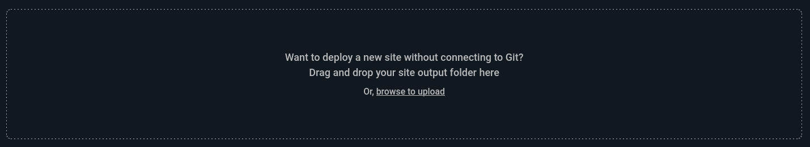
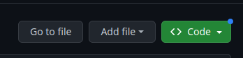

```{r setup, include=FALSE}
library(glue)
library(readxl)
library(writexl)
library(gt)
library(janitor)
library(ggthemes)
library(readODS)
library(patchwork)
library(statBasics)
library(tidyverse)


knitr::opts_chunk$set(echo = TRUE, results = "markup", fig.align = "center",
  cache = FALSE, fig.height = 3)
```

# `rmarkdown`\newline\newline\ `ioslides_presentation`

## `rmarkdown`\newline `ioslides_presentation`

Apresentação em formato `.html`.

Para criar, especifique `output: ioslides_presentation` no cabeçalho YAML.

```yaml
---
title: "Um lindo slide"
author: "Fulano de Tal"
date: 01/01/1900
output: ioslides_presentation
---
```

\colorbox{cabecalho}{\textcolor{titulo}{Neste caso, você pode usar código \texttt{html} no texto.}}

## `rmarkdown`\newline `ioslides_presentation`

\small

Para adicionar um novo slide use `##`:

```markdown
## Um novo slide

Conteúdo do slide
```

Você pode adicionar um subtítulo do slide com `|`:

```markdown
## Título do slide | Subtítulo do slide

Conteúdo do slide
```

Se o slide estiver muito grande, você pode usar `---` para quebrar o conteúdo:

```markdown
## Título do slide | Subtítulo do slide

Conteúdo do slide

---

Essa parte vai para um novo slide
```

\normalsize

## `rmarkdown`\newline `ioslides_presentation`

O `ioslides` tem os seguintes modos de exibição:

* `f`: modo tela cheia
* `w`: modo tela ampla
* `o`: modo _overview_ 
* `h`: modo de destaque do código
* `p`: modo de apresentação para o palestrante
* `esc`: volta ao modo normal de apresentação


## `rmarkdown`\newline `ioslides_presentation`

Algumas configurações disponíveis no cabeçalho YAML:

* `incremental`: itens das listas são apresentadas um por um
  + Campo booleano (`true` - os itens das listas são apresentados um por um )
  + Valor `default`: `false`
* `widescreen`: apresentação em modo de tela ampla
  + Campo booleano (`true` - a apresentação fica em tela ampla)
  + Valor `default`: apresentação em modo de tela normal
* `smaller`: tamanho da fonte menor
  + Campo booleano: (`true` - tamanho da fonte fica um pouco menor)
  + Valor `default`: tamanho normal (12pt)
* `transition`: velocidade de transição entre os slides
  + Valores possíveis: `default`, `slower`, `faster`, ou número real que indica os segundos gastos na transição de slides:
  + Valor `deafult`: `default`
* `logo`: adiciona a logo ao slide
  + Nome do arquivo. Por exemplo, `logo.png`

---

Podemos incluir código `.html` para customização adicional da apresentação com `includes`:

* `in_header`: inclusão de código entre `<header>` e `</header>`
* `before_body`: inclusão de código imediatamente depois `<body>`
* `after_body`: inclusão de código imediatamente antes de `</body>`

```yaml
output:
  pdf_document:
    includes:
      in_header: in_header.html
      before_body: before_body.html
      after_body: after_body.html
```


## `rmarkdown`\newline `ioslides_presentation`

Podemos fazer algumas configuraçãoes específicas para um slide.

\regrafina

Implementação da opção `incremental: true` para um único slide.

```markdown
## Título do slide {.build}
```

\regrafina

Implementação da opção `smaller: true` para um único slide.

```markdown
## Título do slide {.build .smaller}
```

## `rmarkdown`\newline `ioslides_presentation`

Para destacar um parte do código dentro de um _chunk_ usamos `## <b>` e `## </b>`.

\regrafina

**Exemplo:**

\small

`` ```{r} ``
```rmarkdown
library(tidyverse)

## <b>
ggplot(airquality, aes(Ozone)) + geom_histogram(bins = 8)
## </b>

summarise(
  media_ozone = mean(Ozone), dp_ozone = sd(Ozone),
  q1 = quantile(Ozone), mediana = median(Ozone),
  q3 = quantile(Ozone), cv_ozone = dp_ozone / media_ozone
)
```
`` ``` ``

\normalsize

## `rmarkdown`\newline `ioslides_presentation`

Centralização do conteúdo do slide use `<div class="centered">` e `</div>`.

```html
<div class="centered">
  Texto centralizado no slide.
</div>
```

\regrafina

Conteúdo em duas colunas: `<div class="columns">` e `</div>`.

```html
<div class="columns">


+ Primeiro item
+ Segundo item
+ Terceiro item
</div>
```

## `rmarkdown`\newline `ioslides_presentation`

Colorindo texto: `<div class="cor">` e `</div>`.

Onde cor é uma das opções:  `red`, `blue`, `green`, `yellow`, and `gray`.

**Exemplo:**

\small

```html
Isto é muito importante: <div class="red2">coisa importante</div>.
```

\normalsize

\regrafina

Notas para apresentador ~~apenas você vai ver~~ em reuniões on-line: `<div class="notes">` e `</div>`.

```html
<div class="notes">
Texto que apenas o apresentador vai ver!
</div>
```

\textcolor{titulo}{Acrescente \texttt{?presentme=true} no endereço do arquivo \texttt{.html} para ativar o as notas do apresentador.}

## `rmarkdown`\newline `ioslides_presentation`

Use o seguinte comando dentro da linguagem `R` (no console): `pagedown::chrome_print('arquivo.Rmd')`.

\colorbox{cabecalho}{\textcolor{titulo}{Necessário ter o pacote \texttt{pagedown} instalado.}}

\regrafina


**Exemplo:**

```r
pagedown::chrome_print("slides/apresentacao.Rmd")
```

## `rmarkdown`\newline `ioslides_presentation`

Você pode carregar esta apresentação nas plataformas [netlify.com](https://www.netlify.com/) e [github.com](https://github.com/).

**Netlify**

1. Faça login em [netlify.com](https://www.netlify.com/).
1. Clique em _sites_ na barra lateral.
1. Arraste o arquivo `.html` até o quadrado em destaque como apresentado na figura abaixo.

```{r}
#| out.width: 105%
#| echo: false
#| fig.cap: "Colocando sua página on-line usando netlify."

```

---

**GitHub Pages**

1. Faça login em [github.com](https://github.com/).
1. Crie um repositório público chamado `<username>.github.io`. 
  + Se o _username_ é `fulano-tal`, você criará o repositório `fulano-tal.github.io`.
1. Adicione o arquivo `arquivo.html` neste repositório. 
1. Depois de alguns minutos ~~poucos~~, o arquivo está disponível em `https://<username>.github.io/arquivo.html`.
  + Se o _username_ é `fulano-tal` e o arquivo tem nome `arquivo.html`, o arquivo está on-line em `https://fulano-tal.github.io/arquivo.html`.

```{r}
#| out.width: 75%
#| echo: false
#| fig.cap: "Colocando sua página on-line usando GitHub Pages."

```

## `rmarkdown`\newline `ioslides_presentation`

**Exemplo**

Vamos analisar um exemplo!

[exemplo-6](https://ufbabr-my.sharepoint.com/:f:/g/personal/gilberto_sassi_ufba_br/EkgnO10OXN9EgwRNTWBlrz8BhxgoeoZzGwU9vyqHchTFwQ?e=kCV2k8)

## `rmarkdown`\newline `ioslides_presentation`

Crie um documento chamado `apresentacao.html`, e inclua

* `title ` - inclua o seguinte título: **Apresentação ioslides**.
* `date` - data de nascimento.
* `author` - inclua o seu nome.
* logo do pacote `rmarkdown`.
* garanta que as figuras tenham legendas.
* três slides com subtítulo.
* centralize o texto de um dos slides.
* coloco o texto em duas colunas em um dos slides.
* deixa alguma parte do texto azul.
* notas para o apresentador.
* inclua um slide com um chunk com o seguinte código
```r
library(ggthemes)
library(tidyverse)
ggplot(mtcars) +
  geom_histogram(aes(mpg), bins = 7, fill = "blue") +
  theme_calc()
```

---

Use [loremipsum.io](https://loremipsum.io/) para gerar o texto dos slides.

Gere o arquivo `.pdf` da apresentação _ioslides_.


# `rmarkdown`\newline\newline\ `beamer_presentation`

## `rmarkdown`\newline `beamer_presentation`

Apresentação em formato `.pdf`.

Para criar, especifique `output: beamer_presentation` no cabeçalho YAML.

```yaml
---
title: "Apresentação beamer"
author: "Gilberto P. Sassi"
date: 01/01/1900
output: beamer_presentation
---
```


\colorbox{cabecalho}{\textcolor{titulo}{Neste caso, você pode usar \texttt{\LaTeX}\ no texto.}}

## `rmarkdown`\newline `beamer_presentation`

Algumas configurações disponíveis no cabeçalho YAML:

* `theme`: estilo dos slides
  + Veja as opções em [Matrix de temas Beamer](https://hartwork.org/beamer-theme-matrix/)
* `colortheme`: coloração dos slides
  + Veja as opções em [Matrix de temas Beamer](https://hartwork.org/beamer-theme-matrix/)
* `fonttheme`: fonte da apresentação
  + Opções: `default`, `professionalfonts`, `serif`,  `structurebold`, `structureitalicserif`, `structuresmallcapsserif`
  + Veja as fontes em [Fontes disponíveis para `Beamer`](https://deic.uab.cat/~iblanes/beamer_gallery/index_by_font.html)
* `highlight`: formatação do código incluído no texto
  + Valores possíveis: `default`, `tango`, `pygments`, `kate`, `monochrome`, `espresso`, `zenburn`, `haddock`, `breezedark`, `arrow`, e `rstudio`
  + Valor `default`: `default`
* `fig_caption`: inclusão de legenda na figura
  + Campo booleano (apenas `true` e `false`)
  + Valor `default`: `true`

---

* `lang`: especificação da linguagem do documento
  + para português brasileiro use `pt-br`
* `fontsize`: tamanho de fonte
  + Valores possíveis: `10pt`, `11pt`, `12pt`, e outros
  + Valor `default`: `12pt`
* `linkcolor`: cor para links internos dentro do documento
  + Valores possíveis: consulte [pacote `xcolor`](https://www.overleaf.com/learn/latex/Using_colours_in_LaTeX)
* `urlcolor`: cor para link externo dentro do documento
  + Valores possíveis: consulte [pacote `xcolor`](https://www.overleaf.com/learn/latex/Using_colours_in_LaTeX)
* `citecolor`: cor para citações dentro do texto
  + Valores possíveis: consulte [pacote `xcolor`](https://www.overleaf.com/learn/latex/Using_colours_in_LaTeX)
* `citation_package`: processamento das citações dentro do documento
  + Valores possíveis: `pandoc-citeproc`, `natbib`, e `biblatex`
  + Valor `default`: `pandoc-citeproc`
* `keep_tex`: matenha código fonte \LaTeX?
  + Campo booleano (apenas `true` e `false`. Se `true`, mantenha o código fonte \LaTeX)
  + Valor `default`: `false`


---

Podemos incluir código \LaTeX\ para customização adicional do documento com `includes`:

* `in_header`: inclusão de código no preâmbulo (entre `\documentclass{article}` e `\begin{document}`)
* `before_body`: inclusão de código imediatamente depois `\begin{document}`
* `after_body`: inclusão de código imediatamente antes de `\end{document}`

```yaml
output:
  pdf_document:
    includes:
      in_header: preambulo.tex
      before_body: prefixo.tex
      after_body: sufixo.tex
```

## `rmarkdown`\newline `beamer_presentation`

Vamos analisar um exemplo!

[exemplo-7](https://ufbabr-my.sharepoint.com/:f:/g/personal/gilberto_sassi_ufba_br/EilR6FOzfwpNgwv6lL-klfgBMqkuoVWymd1TudVNmvlXKg?e=KqhfR9)

## `rmarkdown`\newline `beamer_presentation`

**Exercício**

Crie um documento chamado `apresentacao.pdf`, e inclua

* `title` - inclua o seguinte título: "Apresentação em pdf".
* `date` - data de nascimento.
* `author` - inclua seu nome.
* três slides com texto dummy.
* mude o tamanho da fonte para 10pt
* especifique o idioma para português do Brasil (`pt-br`)
* inclua o seguinte código entre `\documentclass` e `\begin{document}`
```latex
\usepackage{xcolor}
\usepackage{tikz}
\usepackage{bm}
```

---

* inclua o código imediatamente depois de `\begin{docoument}`
```latex
\doublespacing
```
* escolha um tema, a cor do tema e a fonte dos slides (consulte [galeria de temas](https://deic.uab.cat/~iblanes/beamer_gallery/index.html))

Use [loremipsum.io](https://loremipsum.io/) para gerar o texto para colocar nos slides.

# `rmarkdown`\newline\newline\ `prettydoc`

## `rmarkdown`\newline `prettydoc`

**Objetivo:** Criar documentos `html` com formatação _bonita_ rapidamente.

Para criar, especifque `output: prettydoc::html_pretty` no cabeçalho YAML.

```yaml
---
title: "Um lindo título"
author: "Fulano de tal"
date: 01/01/1900
output: prettydoc::html_pretty
---
```

Para mais informações, consulte [prettydoc.statr.me](https://prettydoc.statr.me/).

## `rmarkdown`\newline `prettydoc`

Configurações disponíveis no cabeçalho YAML.

* `theme`: estilo dos slides
  + Opções disponíveis: `cayman`, `tactile`, `architect`, `leonids`, `hpstr`
* `highlight`: formatação do código no texto
  + Opções disponíveis: `github`, `vignette`

## `rmarkdown`\newline `prettydoc`

**Vamos analisar um exemplo!**

[exemplo-8](https://ufbabr-my.sharepoint.com/:u:/g/personal/gilberto_sassi_ufba_br/EcN43jJaJOlAqKvt3DTBJlkBMMFpx23iX3Wyiwv3Uawt_g?e=LWLTgh)

## `rmarkdown`\newline `prettydoc`

**Exercício**

Crie um documento chamado `documento.html`, e inclua

* `title` - inclua o seguinte título: "um lindo documento"
* `date` - inclua a sua data de nascimento
* `author` - inclua o seu nome
* três slides com texto _dummy_
* inclua o tema `leonids` 
* inclua a formatação de código `github`

Use [loremipsum.io](https://loremipsum.io/) para gerar o texto para colocar nos slides.

# `rmarkdown`\newline\newline\ `rticles`

## `rmarkdown`\newline `rticles`

**Objetivo:** simplificar a produção de textos acadêmicos para revistas científicas.

Para criar um documento, use o seguinte código:

```r
rmarkdown::draft(
  "manuscrito.Rmd",
  template = "elsevier",
  package = "rticles"
)
```

Para consultar as revistas disponíveis use o código `rticles::jornals()`.

## `rmarkdown`\newline `rticles`

**Vamos analisar um exemplo!**

```r
rmarkdown::draft(
    "paper/manuscrito.Rmd",
    template = "acm",
    package = "rticles"
)
```

## `rmarkdown`\newline `rticles`

Crie um manuscrito usando para publicar em uma revista da **springer** dentro da pasta `scripts`.

## `rmarkdown`\newline outras extensões

Algumas pacotes úteis que usam `rmarkdown`:

* pacote para automatização de envio de emails: [`blastula`](https://rstudio.github.io/blastula/)
* pacote para criação de blogs e websites usando o [gerador de site estatístico](https://jamstack.org/)  -- [`Hugo`](https://gohugo.io/): [`blogdown`](https://bookdown.org/yihui/blogdown/)
* pacote para redação de livros: [`bookdown`](https://bookdown.org/yihui/bookdown/)

# `quarto`

## `quarto`

* Próxima geração do pacote `rmarkdown` desenvolvida por [`posit`](https://posit.co/) (sucessor de `rstudio`).
* `quarto` usa `markdown` e \LaTeX\ para produzir documentos.
* `quarto` permite que usemos código das seguintes linguagens:
  + [`python`](https://www.python.org/)
  + [`R`](https://cran.r-project.org/)
  + [`julia`](https://julialang.org/)
  + [`Observable JS`](https://observablehq.com/@observablehq/observable-javascript)
* Se você sabe usar `rmarkdown`, você sabe usar `quarto`.
* Para a linguagem `R`, `quarto` usa `knitr`.
* De forma semelhante ao pacote `rmarkdown`, `quarto` usa `pandoc`.
* Os arquivos tem extensão `.qmd`.
* Para criar documento `.pdf`, é necessário tem \LaTeX\ instalada (por exemplo, [`miktex`](https://miktex.org/) e [`texlive`](https://tug.org/texlive/)).

Para detalhes, consulte [`quarto`](https://quarto.org/).

# `quarto`\newline\newline\ `html`

## `quarto`\newline `html`

Documentos em formato `html`.

Para criar, especifique `format: html` no cabeçalho YAML.

```yaml
---
title: "Título magnífico"
author: "Fulano de Tal"
date: 01/01/1900
format: html
---
```

\colorbox{cabecalho}{\textcolor{titulo}{Neste caso, podemos usamos código \texttt{html} no texto.}}

## `quarto`\newline `html`


Algumas configurações disponíveis no cabeçalho YAML.

* `toc`: inclusão de sumário
  + Campo booleano (`true` inclue o sumário)
  + Valor `default`: `false` 
* `toc-depth`: nível de seção para inclusão no sumário 
  + Valores possíveis: números inteiros de 1 a 6
  + Valor `default`: 6
* `toc-location`: localização do sumário. Essa opção pode estar desabilitada dependendo do tema.
  + Valores possíveis: `left`, `right` e `body`
  + Valor `default`: `right`

---

* `number-sections`: numeração das seções
  + Campo booleano (`true` - as seções serão numeradas)
  + Valor `default`: `false`
* `number-depth`: nível máximo de seção para numeração
  + Valores possíveis: números inteiros entre 1 a 6
  + Valor `default`: 6

Para retirar a numeração de uma seção, use o seguinte `{.unnumbered}`.

```markdown
## Seção {.unnumbered}
```

---

Você pode esconder todos os códigos (`echo: false`) com a seguintes opções:
```yaml
execute:
  echo: true # inclusão do código de todos os chunks
```

Valores possíveis: `false`, `true`, e `fenced`. `fenced` mostra o _chunk_ completamente incluindo `` ```{r} `` e `` ``` ``.

\regrafina

* `embed-resources`: inclusão de figuras, css, js e outros elementos diretamente no código do arquivo `html`
  + Campo booleano (`true` - inclusão das figuras e outros elementos no código)
  + Valor `default`: `false`
* `anchor-sections`: link para seções do documento
  + Campo booleano (`true` - inclusão de links para as seções)
  + Valor `default`: `false`
* `link-external-icon`: mostre um ícone para indicar que o link é externo.
  + Campos booleano (`true` - inclucão do ícone nos links externos)
  + Valor `default`: `false`

---

* `link-external-newwindow`: abrir o link externo em uma nova aba?
  + Campo booleano (`true` - o link é aberto em nova aba)
  + Valor `default`: `false`
* `include-in-header`: inclusão de código `html` imediatamente antes de `</header>`
  + Valor possíveis: _filename_ indicando a localização do arquivo dentro da pasta
* `include-before-body`: inclusão de código `html` imediatamente depois de `<body>`
  + Valor possíveis: _filename_ indicando a localização do arquivo dentro da pasta
* `include-after-body`: inclusão de código `html` imediatamente antes de `</body>`
  + Valor possíveis: _filename_ indicando a localização do arquivo dentro da pasta
* `code-fold`: botão para mostrar/esconder o código
  + Valores possíveis: 
    - `false`: não inclui o botão
    - `true`: inclui o botão com o código escondido
    - `show`: inclui o botão com o código a mostra
  + Valor `default`: `false` 
* `code-summary`: nome para inclusão no botão
  + Valor especial: texto entre aspas

---

```yaml
code-tools:
  source: true
  toggle: true
  caption: "Nome do botão"
```

or

```yaml
code-tools: true
```


`code-tools` inclue o botão para esconder ou mostrar o código de todos os _chunks_.

Subopções de `code-tools`:

* `source`: mostrar o código da página? `true` - inclue o botão para mostrar o código da página.
* `toggle`: mostrar o botão de mostrar/esconder o código de todos os _chunk_? `true` - mostra o botão para mostrar o botão.
* `caption`: nome do botão. Valores possíveis: `none` ou `texto`.

---

* `code-copy`: inclusão de botão de copiar.
  + Valores possíveis:
    - `hover` - inclusão do botão de copiar ao passar o mouse em cima - `default` 
    - `true` - inclusão do botão de copiar
    - `false` - nunca inclua o botão de copiar
* `code-line-number`: numeração nos blocos de código.
  + Campo booleano (`true` - inclua o numeração nos blocos de código)
  + Valor `default`: `false`
* `theme`: tema da página. Por padrão, `quarto` usa _Bootstrap 5_. 
  + Valores possíveis: [temas disponíveis para documentos `html`](https://quarto.org/docs/output-formats/html-themes.html)
* `highlight-style`: tema para formtação dos blocos de código.
  + Valores possíveis: [temas disponíveis para formatação dos blocos de código](https://quarto.org/docs/output-formats/html-code.html#highlighting)

---


\scriptsize

|Código|Descrição|Exemplo|
|:---|:----|----:|
|`max-width`|Largura máxima da página| `max-width: 1400px`|
|`mainfont`|[Fonte do documento](https://developer.mozilla.org/en-US/docs/Web/CSS/font-family)|`mainfont: monospace`|
|`fontsize`|[Tamanho da fonte](https://developer.mozilla.org/en-US/docs/Web/CSS/font-family)|`fontsize: 12px`|
|`fontcolor`|[Cor da fonte (letras)](https://developer.mozilla.org/en-US/docs/Web/CSS/color)|`fontcolor: #ff9522`|
|`monofont`|[Fonte das linhas de códigos](https://developer.mozilla.org/en-US/docs/Web/CSS/font-family)|`monofont: math`|
|`linestretch`|[Correponde a propriedade CSS `line-height`](https://developer.mozilla.org/en-US/docs/Web/CSS/line-height)|`linestretch: 1.7`|
|`backgroundcolor`|[Cor do fundo do documento](https://developer.mozilla.org/en-US/docs/Web/CSS/background-color)|`background: "#9596b4"`|
|`margin-*`|[Corresponde a propriedade CSS `margin`](https://developer.mozilla.org/en-US/docs/Web/CSS/margin)|`margin-top: 1em`|


: Algumas opções de formatação.

`*` pode ser: `left`, `right`, `top`, e `bottom`.
\normalsize

## `quarto`\newline `html`

**Vamos analisar um exemplo!**

[exemplo-10](https://ufbabr-my.sharepoint.com/:f:/g/personal/gilberto_sassi_ufba_br/Em1mAhSxjuBDoykKBRJWHvQBjvcwfKylceSuBv-P7le9aQ?e=exHf9T)

## `quarto`\newline `html`

Crie um documento chamado `documento.html`, e inclua:

* `title` - inclua o seguinte título: `Documento html`
* `date` - inclua a sua data de nascimento
* inclua três seções com texto _dummy_
* inclua o sumário e deixe ele a esquerda
* numere as seções
* inclua figuras, css, js e outros elementos diretamente no código
* mude o tema do documento `html`
* muda o estilo de formatação dos blocos de código
* mude o tamanho da fonte
* mude a largura da linha
* mude a fonte do documento

# `quarto`\newline\newline\ `pdf`

## `quarto`\newline `pdf`

Necessário ter \LaTeX\ instalado (por exemplo, [`miktex`](https://miktex.org/) e [`texlive`](https://tug.org/texlive/)).

Para criar, especifique `format: pdf` no cabeçalho YAML.

```yaml
---
title: "Título do documento .pdf"
author: "Fulano de Tal"
date: 01/01/1900
format: pdf
---
```

\colorbox{cabecalho}{\textcolor{titulo}{Neste caso, podemos usar código \LaTeX\ no texto.}}

Opções semelhantes ao formato `output: pdf_document` do pacote `rmarkdown`.

Verifique as opções em: [opções para `format: pdf`](https://quarto.org/docs/reference/formats/pdf.html).

## `quarto`\newline `pdf`

* `cite-method`: método de produção de citação
  + Valor possíveis: `biblatex`, `natbib`, e `citeproc`
  + Valor `default`: `citeproc`
* `biblio-title`: texto da seção de bibliografia
* `include-in-header`: inclusão de código `latex` imediatamente antes de `\begin{document}`
  + Valor possíveis: _filename_ indicando a localização do arquivo dentro da pasta
* `include-before-body`: inclusão de código `latex` imediatamente depois de `\begin{document}`
  + Valor possíveis: _filename_ indicando a localização do arquivo dentro da pasta
* `include-after-body`: inclusão de código `latex` imediatamente antes de `\end{document}`
  + Valor possíveis: _filename_ indicando a localização do arquivo dentro da pasta

## `quarto`\newline `pdf`

* `pdf-engine`: aplicativo usado para gerar os documentos
  + Valores possíveis: `xelatex`, `pdflatex`, `lualatex`, `tectonic`, `latexmk`, `context`, `wkhtmltopdf`, `prince`, `weasyprint`, e `pdfroff`
  + Valor `default`: `xelatex`
* `lof`: inclua a lista de figuras
  + Campo booleano (`true` - inclusão da lista de figuras)
  + Valor `default`: `false`
* `lot`: inclua a lista de tabelas
  + Campos booleano (`true` - inclusão da lista de tabelas)
  + Valor `default`: `false`

## `quarto`\newline `pdf`

**Vamos analisar um exemplo!**

[exemplo-11](https://ufbabr-my.sharepoint.com/:f:/g/personal/gilberto_sassi_ufba_br/Ehk4nU-6hABMlXzD-m2Ma-QBbs_hoTrcqELCTMF777q7Lg?e=GOKhhi)


## `quarto`\newline `pdf`

**Exercício**

Crie um documento chamado `documento.pdf`, e inclua os seguintes campos no cabeçalho YAML:

* `title` - inclua o seguinte título: "Documento pdf gerado com quarto"
* `date` - inclua sua data de nascimento
* `lang` - inclua o idioma português brasileiro - pt-br
* `fontsize` - formate o texto para 12pt
* inclua 3 cm de margem superior e a esquerda, e 2 cm para margem inferior e a direita
*  inclua o pacote enumerate como preâmbulo
* Inclua duas seções, três parágrafos e o seguinte código (com seu
resultado) em seu documento:

```r
summary(iris)
ggplot(iris) + geom_bar(aes(x = Species))
```

# `quarto`\newline\newline\ `docx`

## `quarto`\newline `docx`


Use `format: pdf` e `format: html` sempre que possível.

`format: docx` é útil por causa do monopólio da Microsoft em produtos de processamento de texto (e planilha).

Para customizar customizações, use template:

* Crie um documento simples `template.docx`:
```bash
quarto pandoc -o relatorio/template.docx \
   --print-default-data-file reference.docx
```
* Modifique o estilo e as configurações de margens deste documento
* Modifique o cabeçalho YAML para:

---

```yaml
---
title: "Um título lindo"
author: "fulnao de tal"
date: 01/01/1900
output:
  docx:
    reference-doc: template.docx
---
```

## `quarto`\newline `docx`

**Vamos analisar um exemplo!**

[exemplo-12](https://ufbabr-my.sharepoint.com/:f:/g/personal/gilberto_sassi_ufba_br/Eumpmr8uaVxBkYslMRphEdcBDSLHag5_79LwD5hBYDl-5Q?e=5WG8A4)

## `quarto`\newline `docx`

Crie um documento chamado `documento.docx`, e inclua os seguinte campos no cabeçalho YAML:

* `title` - inclua o seguinte título: `Documento word usando quarto`
* `date` - inclua sua data de nascimento
* `author` - inclua seu nome
* Inclua um documento de template:
  + Modifique o estilo de título do documento:
  + fonte: times new roman
  + Negrito e itálico
  + tamanho: 30pt
* Inclua três seções com um parágrafos cada.