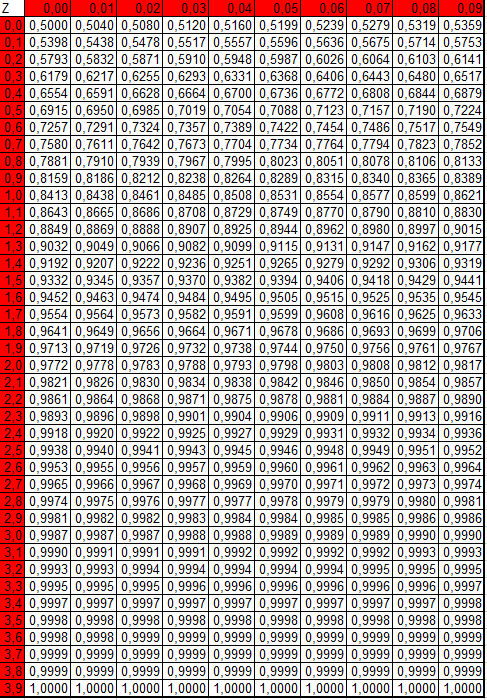
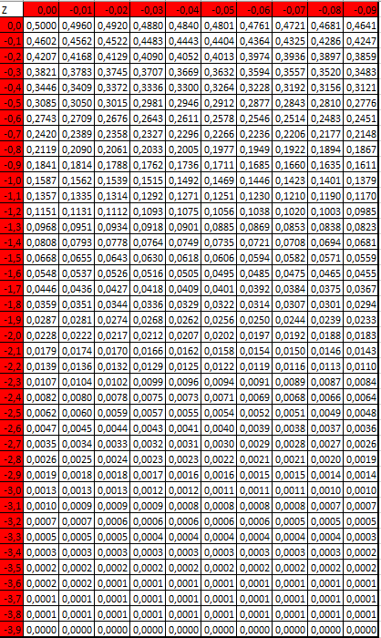

```{r setup, include=FALSE}
knitr::opts_chunk$set(echo = TRUE)
```

# Tabela da distribuição normal: número positivos

Tabela para $P(Z \leq z) = \Phi(z), z \geq 0$.

```{r, out.width="120%", echo = F, fig.align='center'}

```

\newpage

# Tabela da distribuição normal: números negativos

Tabela para $P(Z \leq z) = \Phi(z), z \leq 0$.

```{r, out.width="150%", echo = F, fig.align='center'}

```
