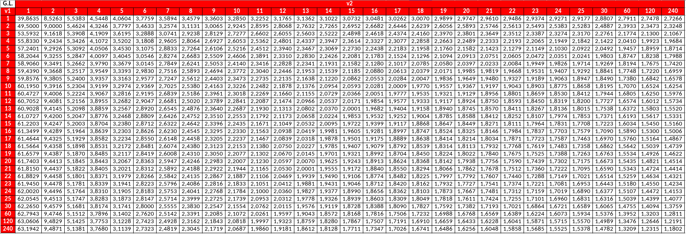
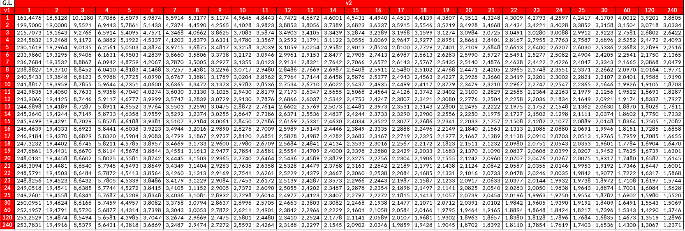
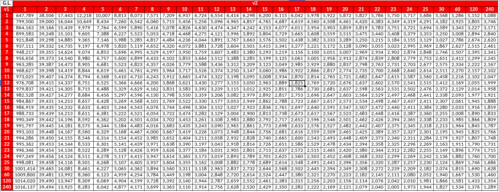
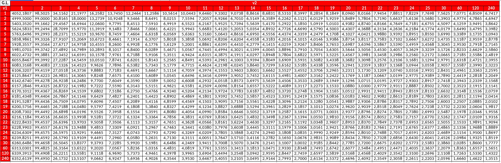
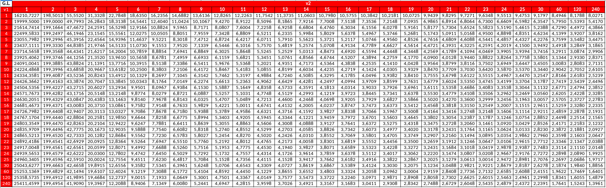

```{r setup, include=FALSE, message=F, warning=F}
knitr::opts_chunk$set(echo = TRUE)
library(openxlsx)
library(tidyverse)
```

# Quantis da distribuição F-Snedecor para alguns valores de $\alpha$

Vamos calcular os quantis da distribuição F-Snedecor, ou seja, vamos achar $f_{\alpha;\nu_1, \nu_2}$ tal que $P(F \leq f_{\alpha; \nu_1, \nu_2})=\alpha$ para $\alpha\in \{0,9; 0,95; 0,975; 0,99; 0,995\}$. Note que, pelas características da distribuição F-Snedecor, temos que $f_{1-\alpha} = \frac{1}{f_{\alpha;\nu_1, \nu_2}}$.

## Quantis para a probabilidade de $\alpha=0,9$

```{r, echo=F,eval=FALSE}
gl <- c(1:25, 30, 60, 120, 240)
a <- 0.9
m <- gl %>% sapply(function(i){
  gl %>% map_dbl(~ qf(a, df1=.x, df2=i))
}) %>% round(4)
colnames(m) <- str_c(gl)
rownames(m) <- str_c(gl)

openxlsx::write.xlsx(m, file = 'alpha_0_9.xlsx', row.names = T)

```

```{r, echo=FALSE, fig.width=4}

```

## Quantis para a probabilidade de $\alpha=0,95$

```{r, echo=F,eval=FALSE}
gl <- c(1:25, 30, 60, 120, 240)
a <- 0.95
m <- gl %>% sapply(function(i){
  gl %>% map_dbl(~ qf(a, df1=.x, df2=i))
}) %>% round(4)
colnames(m) <- str_c(gl)
rownames(m) <- str_c(gl)

openxlsx::write.xlsx(m, file = 'alpha_0_95.xlsx', row.names = T)

```

```{r, echo=FALSE, fig.width=4}

```

\cleardoublepage

## Quantis para a probabilidade de $\alpha=0,975$

```{r, echo=F,eval=FALSE}
gl <- c(1:25, 30, 60, 120, 240)
a <- 0.975
m <- gl %>% sapply(function(i){
  gl %>% map_dbl(~ qf(a, df1=.x, df2=i))
}) %>% round(4)
colnames(m) <- str_c(gl)
rownames(m) <- str_c(gl)

openxlsx::write.xlsx(m, file = 'alpha_0_975.xlsx', row.names = T)

```

```{r, echo=FALSE, fig.width=4}

```

## Quantis para a probabilidade de $\alpha=0,99$

```{r, echo=F,eval=FALSE}
gl <- c(1:25, 30, 60, 120, 240)
a <- 0.99
m <- gl %>% sapply(function(i){
  gl %>% map_dbl(~ qf(a, df1=.x, df2=i))
}) %>% round(4)
colnames(m) <- str_c(gl)
rownames(m) <- str_c(gl)

openxlsx::write.xlsx(m, file = 'alpha_0_99.xlsx', row.names = T)

```

```{r, echo=FALSE, fig.width=4}

```

## Quantis para a probabilidade de $\alpha=0,995$

```{r, echo=F,eval=FALSE}
gl <- c(1:25, 30, 60, 120, 240)
a <- 0.995
m <- gl %>% sapply(function(i){
  gl %>% map_dbl(~ qf(a, df1=.x, df2=i))
}) %>% round(4)
colnames(m) <- str_c(gl)
rownames(m) <- str_c(gl)

openxlsx::write.xlsx(m, file = 'alpha_0_995.xlsx', row.names = T)

```

```{r, echo=FALSE, fig.width=4}

```
