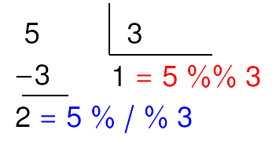

```{r setup, include=FALSE}
knitr::opts_chunk$set(echo = TRUE)
library(readxl)
library(openxlsx)
library(tidyverse)
```

## Preparando o ambiente {.smaller}

* Você precisa de um computador para acompanhar as aulas
* Usaremos nas aulas: [colab.research.google.com/#language=r](https://colab.research.google.com/#create=true&language=r) e o [rstudio.cloud](https://rstudio.cloud)
* Recomendo instalar o `R` com versão pelo `4.1`: [cran.r-project.org](https://cran.r-project.org)
* **IDE** recomendadas: [_RStudio_](https://www.rstudio.com/products/rstudio/download/preview/) e [_VSCode_](https://code.visualstudio.com)
  * Caso você queira usar o [_VSCode_](https://code.visualstudio.com), instale a extensão da linguagem `R`: `ikuyadeu.r`
* Neste curso, usaremos o _framework_ [**tidyverse**](https://www.tidyverse.org):
  * Instale o framework a partir do repositório CRAN: `install.packages("tidyverse")`
* Outras linguagens interessantes (se tivéssemos tempo): [`python`](https://www.python.org) e [`julia`](https://julialang.org)
  * [`python`](https://www.python.org): linguagem interpretada de próposito geral, contemporânea do `R`,  simples e fácil de aprender
  * [`julia`](https://julialang.org): linguagem interpretada para análise de dados, lançada em 2012, promete simplicidade e velocidade
* **Conselho não solicitado:** Aprendam [`HTML`](https://www.freecodecamp.org), [`CSS`](https://www.freecodecamp.org) e [`javascript`](https://www.freecodecamp.org)
  
## O começo de tudo {.smaller}

### O precursor do `R`: `S`

* `R` é uma linguagem derivada do `S`
* `S` foi desenvolvido em `fortran` por **John Chambers** em _1976_ no **Bell Labs**
* `S` foi desenvolvido para ser um ambiente de análise estatística
* Filosofia do `S`: permitir que usuários possam analisar dados usando estatística com pouco conhecimento de programação

### História do `R`

* Em _1991_, **Ross Ihaka** e **Robert Gentleman** criaram o `R` na **Nova Zelândia**
* Em _1995_, **Ross** e **Robert** liberam o `R` sob a licença "GNU General License", o que tornou o `R` um software livre
* Em _1997_, **The Core Group** é criado para melhorar e controlar o código fonte do `R`

## Porque usar `R` 

* Constante melhoramento e atualização
* Portabilidade (roda em praticamente todos os sistemas operacionais)
* Grande comunidade de desenvolvedores que adicionam novas capacidades ao R através de pacotes
* Gráficos de maneira relativamente simples
* Interatividade
* Um grande comunidade de usuários (especialmente útil para resolução de problemas)

## Onde estudar fora de aula?

### Livros 

* **Nível _cheguei agora no rolê_:** [zen do R](https://curso-r.github.io/zen-do-r/index.html)
* **Nível Iniciante:** [R Tutorial na W3Schools](https://www.w3schools.com/r/default.asp)
* **Nível Iniciante:** [Hands-On Programming with `R`](https://rstudio-education.github.io/hopr/)
* **Nível Intermediária:** [`R` for Data Science](https://r4ds.had.co.nz)
* **Nível Avançado:** [Advanced `R`](https://adv-r.hadley.nz)

### Em pt-br

* Curso-R: [material.curso-r.com](http://material.curso-r.com/)

## O que você fazer quando estiver em apuros? {.smaller}

* check a documentação do `R`: 
```{r, echo = T, eval = F}
help(mean)
?mean
```
* Peça ajuda a um programador mais experiente
* Consulte o [pt.stackoverflow.com](https://pt.stackoverflow.com/)
* Use ferramentas de busca como o [google](https://www.google.com.br/) e [duckduckgo.com](https://duckduckgo.com/)
```{r, echo=TRUE, error=TRUE}
log("G")
```
  * Na ferramenta de busca, pesquise por `Error in log("G"): non-numeric argument to mathematical function`

## Operações básicas {.smaller}

#### Soma

```{r}
1 + 1
```

#### Substração

```{r}
2 - 1
```

#### Divisão

```{r}
3 / 2
```

## Operações básicas {.smaller}

#### Potenciação

```{r}
2^3
```


#### Resto da divisão e parte inteira da divisão

```{r}
5 %% 3
```

#### Parte inteira da divisão

```{r}
5 %/% 3
```

---

```{r, echo=FALSE, fig.align='center'}

```

## Estrutura de dados no `R`

* **Estrutura de dados:** atomic `vector` (a estrutura de dados mais básico no `R`), `matrix`, `array`, `list` e `data.frame` (`tibble` no `tidyverse`)
* **Tipo de dados:** caracter (`character`), número real (`double`), número inteiro (`integer`), número complexo (`complex`) e lógico (`logical`)
* **Estrutura de dados Homogênea:** `vector`, `matrix` e `array`
* **Estrutura de dados Heterôgenea:** `list` e `data.frame` (`tibble` no `tidyverse`)


## Tipo de dados no `R` 

#### Número inteiro

```{r}
typeof(1L)
```

#### Número real

```{r}
typeof(1.2)
```

####  Número complexo

```{r}
typeof(1 + 1i)
```

## Tipo de dados no `R` 

#### Número lógico

```{r}
typeof(TRUE)
```

#### Caracter

```{r}
typeof("Gilberto")
```

## Estrutura de Dados Homogênea

#### Vetor

* Agrupamento de valores de mesmo tipo em um único objeto
* Criação de vetores: `c(...)` e `vector('<tipo de dados>', <comprimento do vetor>)`, `vector()` é bastante usado em _laços de repetição_, que veremos na semana 4, o operador `:` e `seq(from = a, to = b, by = c)` 

#### Vetor de caracteres

```{r}
a  <- c("Gilberto", "Sassi")
a
```
```{r}
b <- vector("character", 3)
b
```

## Estrutura de Dados Homogênea 

#### Vetor de número real

```{r}
a  <- c(0.2, 1.35)
a
```

```{r}
b <- vector("double", 3)
b
```

```{r}
d <- seq(from = 1, to = 3.5, by = 0.5)
d
```

## Estrutura de Dados Homogênea 

#### Vetor de número inteiro

```{r}
a  <- c(1L, 2L)
a
```

```{r}
b <- vector("integer", 3)
b
```

```{r}
d <- 1:4
d
```

## Estrutura de Dados Homogênea 

#### Vetor de número inteiro

```{r}
a  <- c(TRUE, FALSE)
a
```

```{r}
b <- vector("logical", 3)
b
```

## Estrutura de Dados Homogênea {.smaller}

#### Matriz

* Agrupamento de valores de mesmo tipo em um único objeto de dimensão 2
* Criação de vetores: `matrix(..., nrow = <integer>, ncol = <integer>)` ou `diag(<vector>)`


#### Matriz de caracteres

```{r}
a <- matrix(c("a", "b", "c", "d"), nrow = 2)
a
```

#### Matriz de números reais

```{r}
a <- matrix(seq(from = 0, to = 1.5, by = 0.5), nrow = 2)
a
```

## Estrutura de Dados Homogênea 

#### Matriz de inteiros

```{r}
a <- matrix(1L:4L, nrow = 2)
a
```

#### Matriz de valores lógicos

```{r}
a <- matrix(c(TRUE, F, F, T), nrow = 2)
a
```

## Estrutura de Dados Homogênea {.smaller}

#### Array

* Agrupamento de valores de mesmo tipo em um único objeto em duas ou mais dimensões
* Criação de vetores: `array(..., dim = <vector of integers>)`

```{r}
dados_matriz_1 <- 10:13
dados_matriz_2  <- 14:17
resultado <- array(c(dados_matriz_1, dados_matriz_2), dim = c(2, 2, 2))
resultado
```

## Estrutura de Dados Homogênea {.smaller}

#### Operações em Vetores númericos (`double`, `integer` e `complex`)

* Operações básicas (operação, substração, multiplicação e divisão ) realizada em cada elemento do vetor
* _Slicing_: extrae parte de um vetor (não precisa ser vetor numérico)

#### _Slicing_

```{r}
a <- c("a", "b", "c", "d", "e", "f", "g", "h", "i")
a[1:5] # selecionado todos os elementos entre o primeiro e o quinta
```

#### Adição (vetores númericos)

```{r}
a <- 1:5
b <- 6:10
a + b
```

## Estrutura de Dados Homogênea 

#### Substração (vetores numéricos)

```{r}
a <- 1:5
b <- 6:10
b - a
```

#### Multiplicação (vetores numéricos)

```{r}
a <- 1:5
b <- 6:10
b * a
```

#### Divisão (vetores numéricos)

```{r}
a <- 1:5
b <- 6:10
b / a
```

## Estrutura de Dados Homogênea 

### Operações em Matrizes númericas (`double`, `integer` e `complex`)

* Operações básicas (operação, substração, multiplicação e divisão) realizada em cada elemento das matrizes
* Multiplicação de matrizes (vide [multiplicação de matrizes](https://pt.wikipedia.org/wiki/Produto_de_matrizes)), inversão de matrizes (vide [inversão de matrizes](https://pt.wikipedia.org/wiki/Matriz_inversa)), matriz transposta (vide [matriz transposta](https://pt.wikipedia.org/wiki/Matriz_transposta)), determinante (vide [determinante de uma matriz](https://pt.wikipedia.org/wiki/Determinante)) e solução de sistema de equações lineares (vide [sistema de equações lineares](https://pt.wikipedia.org/wiki/Sistema_de_equações_lineares))

## Estrutura de Dados Homogênea {.smaller}

#### Soma de matrizes

```{r}
A <- matrix(c(1, 2, 3, 4), nrow = 2)
B <- matrix(5:8, ncol = 2)
C <- A + B
C
```

#### Soma de substração

```{r}
A <- matrix(c(1, 2, 3, 4), nrow = 2)
B <- matrix(5:8, ncol = 2)
C <- B - A
C
```

## Estrutura de Dados Homogênea {.smaller}

#### Multiplicação ponto-a-ponto ou produto de Hadamard 

* Para detalhes vide [produto de Hadamard](https://en.wikipedia.org/wiki/Hadamard_product_(matrices))

```{r}
A <- matrix(c(1, 2, 3, 4), nrow = 2); B <- matrix(5:8, ncol = 2)
C <- A * B
C
```

#### Multiplicação de matrizes

* Para detalhes vide [multiplicação de matrizes](https://pt.wikipedia.org/wiki/Matriz_inversa)

```{r}
C <- A %*% B
C
```

## Estrutura de Dados Homogênea {.smaller}

#### Matriz inversa 

* Para detalhes vide [matriz inversa](https://pt.wikipedia.org/wiki/Matriz_inversa)

```{r}
A <- matrix(1:4, ncol = 2)
B <- solve(A)
B
A %*% B
```

## Estrutura de Dados Homogênea {.smaller}

#### Matriz transposta

* Para detalhes vide [matriz transposta](https://pt.wikipedia.org/wiki/Matriz_transposta)

```{r}
A <- matrix(1:4, ncol = 2)
B <- t(A)
B
```

#### Determinante de uma matriz

* Para detalhes vide [determinante](https://es.wikipedia.org/wiki/Determinante_(matemática))

```{r}
A <- matrix(1:4, ncol = 2)
det(A)
```

## Estrutura de Dados Homogênea {.smaller}

#### Solução de sistema de equações lineares {.smaller}

* Para detalhes vide [sistema de equações lineares](https://pt.wikipedia.org/wiki/Sistema_de_equações_lineares)

```{r}
b <- c(1, 2); A <- matrix(1:4, nrow = 2)
x <- solve(A, b)
x
```

#### Matriz inversa generalizada

* $G$ é a matriz inversa generalizada de $A$ se $A \cdot G \cdot A = A$. Para detalhes vide [matriz inversa generalizada](https://en.wikipedia.org/wiki/Generalized_inverse)

```{r, message=FALSE}
library(MASS) # ginv é uma função do pacote MASS
A <- matrix(c(1, 1, 2, 3), nrow = 2)
ginv(A)
```

## Estrutura de Dados Homogênea {.smaller}

#### Outras operações com matrizes

|Operador ou função|Descrição|
|:--------------:|:-----------:|
|`A %o% B`| [produto diádico $A\cdot B^T$](https://pt.wikipedia.org/wiki/Produto_diádico)|
|`crossprod(A, B)`|[$A\cdot B^T$](https://pt.wikipedia.org/wiki/Produto_diádico)|
|`crossprod(A)`|[$A\cdot A^T$](https://pt.wikipedia.org/wiki/Produto_diádico)|
|`diag(x)`|retorna uma matrix diagonal com diagonal igual a `x` (`class(x) == 'numeric'`)|
|`diag(A)`|retorna um vetor com a diagona de $A$ (`class(A) == 'matrix'`)|
|`diag(k)`|retorna uma matriz diagona de ordem $k$ (`class(k) == 'numeric'`)|
|`rowMeans(A)`| retorna um vetor com as médias das linhas|
|`colMeans(A)`| retorna um vetor com as médias das colunas|


## Estrutura de Dados Heterogênea 

#### Lista

* Agrupamento de valores de tipos diversos e estrutura de dados 
* Criação de listas: `list(...)` e `vector("list", <comprimento da lista>)`

```{r}
a <- list(pedido_id = 8001406,
          nome = "Fulano",
          sobrenome = "de Tal",
          cpf = "12345678900",
          itens = list(list(descricao = "Ferrari",
                            frete = 0,
                            valor = 500000),
                      list(descricao = "Dolly", frete = 1.5, valor = 3.90)))

```

## Estrutura de Dados Heterogênea {.smaller}

* Agrupamento de dados em tabela em que: cada coluna é uma variável; cada linha é uma observação
* Criaççao de `tibble`: `tibble(...)` e `tribble(....)`

#### `tibble` (data frame)

```{r}
library(tidyverse) # carregando o framework tidyverse
a <- tibble(variavel_1 = c(1, 2), variavel_2 = c("a", "b"))
glimpse(a)
a
```

## Estrutura de Dados Heterogênea {.smaller}

#### Operações em um `tibble`

Vamos ver o uso dessas funções depois de aprender a carregar os dados no `R`.

|Função|Descrição|
|:---------:|:------------:|
|`head()`|Mostra as primeiras linhas de um `tibble`|
|`tail()`|Mostra as últimas linhas de um `tibble`|
|`glimpse()`|Impressão de informações básicas dos dados|
|`add_case()` ou `add_row()`|Adiciona uma nova observação|

## Estrutura de Dados Heterogênea {.smaller}

#### Concatenação de listas

```{r}
a  <- list("a", "b")
b <- list(1, 2)
d <- c(a, b)
d
```

## Estrutura de Dados Heterogênea {.smaller}

#### _Slicing_ a lista

```{r}
d[1:2]
```

#### Acessando o valor de elmento em uma lista

```{r}
d[[2]] # acessando o segundo elemento da lista d
```

#### Acessando o valor de elmento em uma lista pela chave

```{r}
d <- list(chave_1 = 1, chave_2 = "docente")
d$chave_2 # retorna o valor
```

## Estrutura de Dados Heterogênea {.smaller}

#### _Slicing_ uma lista por chaves

```{r}
d <- list(chave_1 = 1, chave_2 = "docente", chave_3 = list("olá"))
d[c("chave_2", "chave_3")] # funciona como slicing
```

#### Enumerando chaves em um lista

```{r}
d <- list(c(1, 2, 3), chave_1 = 1, chave_2 = "docente", chave_3 = list("olá"))
names(d)
```


## Valores especiais em `R`

|Valores especiais|Descrição|Função para identificar|
|:-------------:|:---------------:|:--------------------:|
|`NA` (Not Available)|Valor faltante.|`is.na()`|
|`NaN` (Not a Number)|Resultado do cálculo indefinido.|`is.nan()`|
|`Inf` (Infinito)|Valor que excede o valor máximo que sua máquina aguenta.|`is.inf()`|
|`NULL` (Nulo)|Valor indefinido de expressões e funções (diferente de `NaN` e `NA`)|`is.null()`|

## Parênteses 1: guia de estilo no `R` {.smaller}

* Nome de um objeto precisa ter um _significado_. Esse significado precisa falar imediatamente o que este objeto é ou faz ~sua bisavó precisa entender o que este objeto é ou faz~
* Use a convenção do `R`:
  * Use apenas letras minúsculas, números e _underscore_ (comece sempre com letras minúsculas)
  * Nomes de objetos precisam ser substantivos e precisam descrever o que este objeto é ou faz (seja conciso, direto e significativo)
  * Evite ao máximo os nomes que são usados por objetos que são _buit-in_ do `R`
  * Coloque espaço depois da vírgula
  * Não coloque espaço antes nem depois de parênteses. Exceção: Coloque um espaço `()` antes e depois de `if`, `for` ou `while`, e coloque um espaço depois de `()`.
  * Coloque espaço entre operadores básicos: `+`, `-`, `*`, `==` e outros. Exceção: `^`.
* Para mais detalhes, consulte: [guia de estilo do `tidyverse`](https://style.tidyverse.org)


## Parênteses 2: estrutura de diretórios  {.smaller}

* Mantenha uma estrutura consistente de diretórios em seus projetos.
* Eu uso a seguinte estrutura:
  * `data`: diretório para armazenar seus conjuntos de dados
    * `raw`: dados brutos
    * `processed`: dados processados
  * `scripts`: código fonte do seu projeto
  * `figures`: figuras criadas no seu projeto
  * `output`: outros arquivos que não são figuras
  * `previous`: arquivos da versão anterior do projeto
  * `notes`: notas de reuniões e afins
  * `relatorio` (ou `artigos`): documento final de seu projeto
  * `documents`: livros, artigos e qualquer coisa que são referências em seu projeto
* Para mais detalhes, consulte esse guia do [curso-r](https://curso-r.com): [diretórios e `.Rproj`](https://curso-r.github.io/zen-do-r/rproj-dir.html)

## Lendo dados no `R`

### Leitura de arquivos no formato `xlsx` ou `xls`

* **Pacote:** `readxl` do `tidyverse` (instale com o comando `install.packages('readxl')`)
* Parêmetros das funções `read_xls` (para ler arquivos `.xls`) e `read_xlsx` (para ler arquivos `.xlsx`):
  * `path`: caminho até o arquivo
  * `sheet`: especifica a planilha do arquivo que será lida
  * `range`: especifica uma área de uma planilha para leitura. Por exemplo: `B3:E15`
  * `col_names`: Argumento lógico com valor padrão igual a `TRUE`. Indica se a primeira linha tem o nome das variáveis
* Para mais detalhes, consulte a documentação oficial do _tidyverse_: [documentação de `read_xl`](https://readxl.tidyverse.org)

## Lendo dados no `R`

### Leitura de arquivos no formato `xlsx` ou `xls`

```{r}
library(tidyverse)
library(readxl)
dados_iris <- read_xlsx("data/raw/iris.xlsx")

head(dados_iris, n = 4)
```

## Lendo dados no `R` {.smaller}

### Leitura de arquivos no formato `csv`

* **Pacote:** `readr` do `tidyverse` (instale com o comando `install.packages('readr')`)
* Parêmetros das funções `read_csv` e `read_csv2`:
  * `path`: caminho até o arquivo

#### Padrão imperial inglês versus o resto do planeta

* Se você mora ou está em países que usam o padrão _imperial inglês_:
  * colunas separadas por `,`
  * casa decimal indicada por `.`
* Se você mora ou estão em países que usam o sistema métrico:
  * colunas separadas por `;`
  * casa decimal por `,`

**Preste atenção em como o seus dados estão armazenados!**

Para mais detalhes, consulte a documentação oficial do _tidyverse_: [documentação de `read_r`](https://readr.tidyverse.org)

## Lendo dados no `R` {.smaller}

### Leitura de arquivos no formato `csv`

```{r}
library(tidyverse)
library(readr)
dados_mtcars <- read_csv2("data/raw/mtcars.csv")

```

## Lendo dados no `R` 

### Leitura de arquivos no formato `ods`

* **Pacote:** `readODS`  (instale com o comando `install.packages('readODS')`)
* Parêmetros das funções `read_ods`:
* `path`: caminho até o arquivo
  * `sheet`: especifica a planilha do arquivo que será lida
  * `range`: especifica uma área de uma planilha para leitura. Por exemplo: `B3:E15`
  * `col_names`: Argumento lógico com valor padrão igual a `TRUE`. Indica se a primeira linha tem o nome das variáveis

* Para mais detalhes, consulte a documentação do _readODS_: [documentação de `readODS`](https://github.com/chainsawriot/readODS)

## Lendo dados no `R` 

### Leitura de arquivos no formato `ods`

```{r}
library(tidyverse)
library(readODS)
dados_toothgrowth <- read_ods("data/raw/ToothGrowth.ods")

glimpse(dados_toothgrowth)
```

## Salvando dados no `R`

### Salvar no formato `.csv` (sistema métrico)

```{r}
library(readr)
write_csv2(dados_toothgrowth, file = "data/processed/dados_csv2.csv")
```

### Salvar no formato `.xlsx` 

```{r}
library(writexl)
write_xlsx(dados_toothgrowth, path = "data/processed/dados_xlsx.xlsx")
```

### Salvar no formato `ods`

```{r}
library(readODS)
write_ods(dados_toothgrowth, path = "data/processed/dados_ods.ods")
```